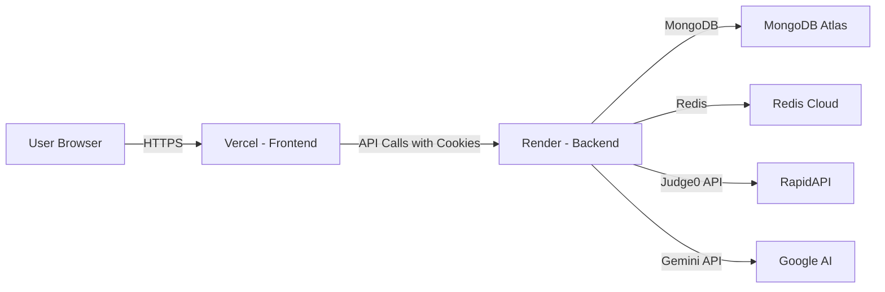

# ZenCode — Complete Platform Documentation

> A full-stack, AI-powered LeetCode-style competitive coding platform with intelligent DSA tutoring, built with **Node.js/Express** backend and **React 19** frontend.

---

## ✨ Features at a Glance

### 🔐 Secure Authentication & Role-Based Access
- JWT-based cookie authentication with HTTP-only, secure, SameSite cookies
- Redis-backed token blacklisting for reliable session invalidation on logout
- Role-based access control — separate middleware guards for regular users and admins
- Full auth lifecycle: Register, Login, Logout, Session Restore, Profile Edit, Password Reset

### 📚 Curated DSA Problem Library
- Paginated catalog of Data Structures & Algorithms problems organized by topic and difficulty
- Problems support rich Markdown descriptions, examples with explanations, and multiple language starter templates
- Tag-based grouping (Arrays, Trees, Dynamic Programming, Graphs, etc.) with collapsible accordion UI
- Admin-created problems with validated reference solutions — ensuring every official answer actually passes before publishing
- Solved badges, progress tracking, and a random problem picker for spontaneous practice

### 💻 IDE-Style Code Execution Environment
- Full-fledged **Monaco Editor** (the engine behind VS Code) integrated directly in the browser
- Three-panel resizable layout: Problem Description | Code Editor | Test Results
- Multi-language support: JavaScript, C++, Java, Python with language-specific starter templates
- **Run Mode**: Instant feedback against visible test cases — no submission record, purely for iteration
- **Submit Mode**: Graded evaluation against hidden test cases via **Judge0** — creates a permanent submission record with status, runtime, memory, and error details
- Driver code wrapping: problems can define prefix/suffix boilerplate per language to wrap user code before execution (LeetCode-style function signatures)
- Previous/Next problem navigation and a built-in stopwatch timer

### 🤖 AI-Powered DSA Tutor (Google Gemini)
- In-page AI chat assistant embedded directly in the problem-solving view
- Powered by Google Gemini via a secure backend proxy (API key never exposed to the browser)
- Configured with a strict **DSA Instructor** persona using the Socratic method — provides hints and step-by-step guidance before revealing full solutions
- Context-aware: receives the current problem title, description, user's code, and language on every request
- Quick-action buttons: "Give me a hint", "Explain the approach", "Review my code"
- Session-scoped conversations — reloading resets the chat, keeping it lightweight

### 📊 Progress Dashboard & Profile
- Animated SVG progress ring and GSAP-powered counters showing solved percentage
- Stats cards: Problems Solved, Total Problems, Current Streak, Days Active
- Recent solved questions with direct links back to the problems
- Account details with inline profile editing and password reset
- Auto-refresh: polls stats every 15 seconds and on window focus/visibility changes

### 🛡️ Admin Panel
- Comprehensive problem creation form with Zod validation and React Hook Form
- Dynamic field arrays for examples, test cases, starter code, driver code, hints, and reference solutions
- Reference solution validation: backend runs admin solutions through Judge0 before saving to catch broken answers early
- Problem update and delete capabilities
- Cleanup utility for orphaned data during development

### ⚡ Performance & Reliability
- **Redis caching** for frequently accessed data (problemset lists) to reduce database load
- Paginated API responses with `hasMore` flags for efficient data transfer
- Judge0 integration with exponential backoff retry logic for both batch submission and result polling
- Environment-configurable retry tuning (submit retries, poll retries, delays, intervals)
- **Backend Wake Detection**: frontend detects Render free-tier cold starts and shows a countdown loading screen (~60s)
- Graceful degradation: server starts even if Redis connection fails

### 🎨 Rich UI & Animations
- **GSAP** scroll-triggered animations and hero text reveals on the landing page
- **Framer Motion** declarative animations for page transitions and component entrances
- **Lenis** smooth scrolling throughout the application
- Dark theme with gradient backgrounds, glass-panel effects, and custom scrollbar styling
- Premium component library (**HeroUI / DaisyUI**) with Tailwind CSS v4 for rapid, consistent styling

### 🚀 Production Deployment
- **Frontend on Vercel** with SPA routing via `vercel.json`
- **Backend on Render** with Node.js 22.x, trust proxy enabled for correct cookie behavior
- **MongoDB Atlas** for persistent data storage
- **Redis Cloud** (AWS ap-south-1-1) for JWT blacklisting
- Cross-origin cookie support with production-safe CORS configuration

---

## 🚀 Project Overview

**ZenCode** is a comprehensive, AI-powered platform designed to provide a structured roadmap to technical interview success. It empowers software engineering candidates by offering curated Data Structures and Algorithms (DSA) practice, real-time code compilation, AI-driven mock interviews, and automated resume building.

Whether you are a beginner looking to build problem-solving intuition or an experienced developer aiming to crack top-tier tech interviews, ZenCode systematically guides your preparation.

### What ZenCode Is Today

ZenCode is currently a full-stack DSA practice platform with these working pillars:

- Cookie-based authentication with user and admin roles.
- A problem library that authenticated users can browse.
- An IDE-style problem page with a Monaco editor, sample test runner, hidden-test submission flow, and submission history.
- A profile page that summarizes solved progress and recent accepted questions.
- An admin panel for creating new problems.
- A session-only AI helper for problem discussion and code review.

ZenCode also contains some roadmap-style UI and copy for broader ideas like mock interviews or resume tooling, but those flows are not implemented as first-class routed features in the current codebase.

### Live Deployment

| Layer | Platform | URL |
|-------|----------|-----|
| Frontend | **Vercel** | `https://zencode-project.vercel.app` |
| Backend | **Render** | Configured via `VITE_API_BASE_URL` env |
| Database | **MongoDB Atlas** | Cluster on `cluster0.k275vhl.mongodb.net` |
| Cache | **Redis Cloud** | `redis-15582.crce263.ap-south-1-1.ec2.cloud.redislabs.com` |

---

## 💻 Day-to-Day Use Cases

### 1. A Learner Signs In and Practices DSA (The Core Loop)
- **Log in daily** to view the "Today's Sprint" tracker on the dashboard.
- **Navigate to the Problemset** to find curated DSA challenges organized by topic (e.g., Arrays, Trees, Dynamic Programming).
- **Use the built-in IDE** (powered by Monaco Editor) to write code and execute it in real-time against test cases.
- **Track progress:** Completed problems update the user's progress bar, maintaining a persistent run streak to build consistency.

### 2. An Admin Authors New Problems
The admin opens the admin panel, fills out the problem form, optionally includes reference solutions, and saves a new question after the backend validates those solutions with Judge0.

### 3. A Learner Reviews Progress
The learner visits the profile page to see how many problems have been solved, what percentage of the catalog is done, and which questions were most recently accepted.

### 4. A Learner Asks the AI Assistant for Guidance
Inside the problem page, the learner opens the AI tab and asks for hints, approach explanations, or code review help. The conversation lasts for the current page session only.

### 5. AI Mock Interviews (Weekly Practice — Roadmap Feature)
Before a real interview, users can launch the **AI Mock Interviewer**. Practice behavioral and technical questions dynamically generated by AI. Receive real-time, constructive feedback on answers.

### 6. Resume Optimization (Pre-Application — Roadmap Feature)
Use the **Smart Resume Maker** to auto-generate an ATS-friendly resume. The tool highlights coding skills, core competencies, and statistics from the user's ZenCode solving history.

### 7. Preliminary Round Prep (Roadmap Feature)
Sharpen quantitative math and logical reasoning skills using the **Adaptive Aptitude** quiz module, tailored through AI to match the user's skill level.

---

## 🛠️ Technology Stack

### Backend

| Tool / Library | Version | Purpose |
|----------------|---------|---------|
| **Node.js** | 22.x | Runtime |
| **Express** | 5.2.1 | HTTP framework |
| **Mongoose** | 9.1.2 | MongoDB ODM |
| **Redis** (`redis` npm) | 5.10.0 | JWT blacklist store |
| **bcrypt** | 6.0.0 | Password hashing |
| **jsonwebtoken** | 9.0.3 | Stateless auth tokens |
| **Axios** | 1.13.2 | HTTP client for Judge0 API |
| **@google/genai** | 1.42.0 | Gemini AI integration |
| **dotenv** | 17.2.3 | Environment variables |
| **cookie-parser** | 1.4.7 | Parse HTTP cookies |
| **cors** | 2.8.5 | Cross-origin support |
| **validator** | 13.15.26 | Email / password validation |
| **nodemon** | 3.1.11 (dev) | Hot reload in development |

### Frontend

| Tool / Library | Version | Purpose |
|----------------|---------|---------|
| **React** | 19.2.3 | UI library |
| **Vite** | 7.2.4 | Build tool & dev server |
| **TailwindCSS** | 4.1.18 | Utility-first CSS |
| **DaisyUI** | 5.5.14 | Tailwind component library |
| **HeroUI** | — | Component library |
| **Redux Toolkit** | 2.11.2 | Global state management |
| **React Router** | 7.12.0 | Client-side routing |
| **Monaco Editor** (`@monaco-editor/react`) | 4.7.0 | In-browser code editor |
| **GSAP** | 3.13.0 | Complex scroll & reveal animations |
| **Motion** (Framer Motion) | 12.26.2 | Declarative page/component animations |
| **Lenis** | — | Smooth scrolling |
| **React Hook Form** | 7.71.1 | Form management |
| **Zod** | 4.3.5 | Schema-based form validation |
| **Axios** | 1.13.2 | HTTP client |
| **React Markdown** | 10.1.0 | Markdown rendering in chatbot |
| **react-resizable-panels** | 4.5.3 | IDE-style resizable layout |
| **Lucide React / Heroicons / Tabler Icons** | various | Icon libraries |

### External APIs

| API | Provider | Purpose |
|-----|----------|---------|
| **Judge0** | RapidAPI (`judge029.p.rapidapi.com`) | Remote code execution & evaluation |
| **Gemini** | Google (`@google/genai`) | AI-powered DSA tutoring chatbot |

---

## 📂 Repository & File Structure

```
ZenCode/
├── Backend/
│   ├── .env                          # Environment variables
│   ├── package.json                  # Dependencies & scripts
│   └── src/
│       ├── index.js                  # Express server entry point
│       ├── config/
│       │   ├── database.js           # MongoDB connection
│       │   └── redis.js              # Redis client setup
│       ├── controllers/
│       │   ├── UserAuth.controller.js # Auth lifecycle (7 functions)
│       │   ├── ai.controller.js       # Gemini AI proxy (2 functions)
│       │   ├── problem.controller.js  # Problem CRUD (8 functions)
│       │   └── submission.controller.js # Run/Submit code (3 functions)
│       ├── middleware/
│       │   ├── auth.middleware.js     # JWT + Redis verification
│       │   └── admin.middleware.js    # Admin role check
│       ├── model/
│       │   ├── user.js               # User schema
│       │   ├── problem.js            # Problem schema
│       │   ├── submission.js          # Submission schema
│       │   └── chatHistory.js         # Empty (placeholder)
│       ├── routes/
│       │   ├── auth.routes.js         # 8 auth endpoints
│       │   ├── problem.routes.js      # 8 problem endpoints
│       │   ├── submission.routes.js   # 3 submission endpoints
│       │   └── ai.routes.js           # 1 AI endpoint
│       └── utils/
│           ├── authValidator.js       # Registration validation
│           └── problem.utils.js       # Judge0 integration (5 functions)
│
├── Frontend/
│   ├── package.json                  # Dependencies & scripts
│   ├── vite.config.js                # Vite configuration
│   ├── vercel.json                   # Vercel SPA routing
│   ├── index.html                    # HTML entry point
│   └── src/
│       ├── main.jsx                  # React bootstrap
│       ├── App.jsx                   # Router + backend detection
│       ├── authSlice.js              # Redux auth state (6 thunks)
│       ├── index.css                 # Global styles
│       ├── App.css                   # App-level styles
│       ├── api/
│       │   └── submission.js         # Submission API helpers (3 functions)
│       ├── store/
│       │   └── store.js              # Redux store config
│       ├── utils/
│       │   └── axiosClient.js        # Configured Axios instance
│       ├── pages/
│       │   ├── Homepage.jsx          # Landing page (GSAP + Motion)
│       │   ├── Loginpage.jsx         # Sign in (Zod + RHF)
│       │   ├── Signupform.jsx        # Registration (Zod + RHF)
│       │   ├── Problemset.jsx        # Problem catalog (grouped view)
│       │   ├── Problempage.jsx       # IDE solving view (resizable panels)
│       │   ├── Profile.jsx           # User dashboard (animated stats)
│       │   └── Adminpage.jsx         # Problem creation form
│       ├── components/
│       │   ├── Navbar.jsx            # Navigation bar
│       │   ├── LeftPanel.jsx         # Problem description + AI chat
│       │   ├── UpperRightPanel.jsx   # Monaco code editor
│       │   ├── BottomRight.jsx       # Test results output
│       │   ├── Chatbot.jsx           # AI chat interface
│       │   ├── Timer.jsx             # IDE stopwatch
│       │   ├── Loader.jsx            # Loading spinner
│       │   └── BackendWakeScreen.jsx # Cold start screen
│       └── assets/
│           └── homepage_ai_bg_clean.png # Landing page background
```

---

## 🔄 End-to-End Workflows

### App Boot & Session Restore
This is the first workflow that runs for almost every real user.

1. `Frontend/src/main.jsx` mounts the app inside `BrowserRouter` and Redux `Provider`.
2. `Frontend/src/App.jsx` dispatches `checkAuth()` on mount.
3. `checkAuth()` calls `GET /user/check` through `axiosClient`.
4. `Backend/src/middleware/auth.middleware.js` reads the `token` cookie, rejects blacklisted tokens from Redis, verifies the JWT, and loads the user from MongoDB.
5. If the cookie is valid, the backend returns the user payload.
6. The Redux auth slice marks the user as authenticated.
7. Protected routes such as `/problemset`, `/problem/:id`, `/profile`, and `/admin` become accessible.

**Why this matters:**
- The app does not keep auth state in local storage.
- The backend cookie is the real source of truth.
- Redux is only the client-side mirror of that session.

**Backend Wake Detection (Render Free Tier):**
On Render deploys, `App.jsx` polls the backend root `/` endpoint every 3 seconds until alive. It shows a `BackendWakeScreen` with a countdown timer during the cold start (~60 seconds).

### Registration Flow

1. The user fills `Frontend/src/pages/Signupform.jsx`.
2. `react-hook-form` and Zod validate the payload on the client (including password confirmation via `.refine()`).
3. The page dispatches `registerUser()` from `Frontend/src/authSlice.js`.
4. The backend route `POST /user/register` lands in `registerUser` inside `Backend/src/controllers/UserAuth.controller.js`.
5. `Backend/src/utils/authValidator.js` checks names, password strength, age, gender, and email format.
6. The password is hashed with `bcrypt` (10 rounds).
7. A new user document is created in MongoDB with `role: "user"` forced server-side.
8. A JWT is signed (1-hour expiry) and stored in an HTTP-only cookie.
9. The frontend receives the user payload and treats the user as logged in immediately.
10. The UI redirects to `/problemset`.

**Cookie Configuration (production-safe):**
- `httpOnly: true` — prevents XSS access
- `sameSite: "none"` in production (for cross-origin Vercel ↔ Render)
- `secure: true` in production (HTTPS only)
- `maxAge: 1 hour`

### Login Flow

1. The user fills `Frontend/src/pages/Loginpage.jsx`.
2. Zod schema validates email + password (min 8 chars). Password visibility toggle with Heroicons eye/slash icons.
3. The page dispatches `loginUser()`.
4. The backend route `POST /user/login` checks the email and compares the password with `bcrypt.compare`.
5. If credentials are valid, a new JWT is issued in the cookie.
6. Redux stores the returned user data and the user is redirected to `/problemset`.
7. A custom floating toast shows success/error messages with auto-dismiss (3.2s).

### Logout Flow

1. The user clicks logout from `Frontend/src/components/Navbar.jsx`.
2. The frontend dispatches `logoutUser()`.
3. The backend route `POST /user/logout` decodes the JWT, stores it in Redis as blocked (key: `token:{jwt}`), and sets the Redis expiry to match the token's `exp` claim.
4. The cookie is cleared.
5. Redux resets the auth state.
6. The login page shows a success toast (received via `location.state` from the nav).

**Why Redis exists:**
- JWTs are stateless by default.
- Redis gives the app a practical way to invalidate a token before its natural expiry.

### Browsing The Problemset

1. `Frontend/src/pages/Problemset.jsx` loads after authentication.
2. It repeatedly calls `GET /problem/getAllProblems?page=n` until `hasMore` is false (auto-pagination).
3. It separately calls `GET /problem/user` to fetch the current user's solved set and builds a lookup map.
4. The page groups problems by tag using `useMemo`, then sub-groups by difficulty (easy/medium/hard).
5. It renders collapsible topic groups with solved badges (green checkmark + "Solved" label).
6. A stats bar shows total, easy, medium, hard counts + overall progress percentage with animated progress bar.
7. Admin users get "Admin Panel" button, "Delete" button on each problem, and a shortcut into the admin page.
8. A "Random Question" button opens a random problem from the list.

**Important implementation detail:**
- The backend paginates in chunks of 15, but the frontend pulls every page up front and builds a richer grouped view client-side.

### Opening A Problem

1. The user navigates to `/problem/:id`.
2. `Frontend/src/pages/Problempage.jsx` calls `GET /problem/problemById/:id`.
3. The backend `getProblemById` controller returns full problem data (description, examples, initial code, test cases, editorial).
4. The page stores the returned document in `problemData`.
5. It picks the starter code for the currently selected language and seeds the Monaco editor.
6. In parallel, the page fetches the full problem ID sequence from the paginated problem list so the previous/next buttons can work.
7. The three-panel layout loads:
   - **Left (40%)**: Problem description, examples, editorial via `LeftPanel`
   - **Upper Right (65%)**: Code editor via `UpperRightPanel` (Monaco Editor)
   - **Bottom Right (35%)**: Test results output via `BottomRight`

### Run Code Workflow
Run is the lightweight "check my sample cases" loop.

1. The user clicks `Run`.
2. `Frontend/src/pages/Problempage.jsx` calls `runCodeApi(problemId, code, language)`.
3. The frontend hits `POST /submission/run/:id`.
4. `Backend/src/controllers/submission.controller.js` validates the user, problem, code, and language.
5. If the problem defines `driverCode`, the backend wraps the user's solution with the language-specific prefix/suffix boilerplate.
6. The backend sends one Judge0 submission per visible test case through `submitBatch()`.
7. `submitToken()` polls Judge0 until all results are ready or a retry limit is hit.
8. The controller aggregates runtime, memory, and first failure information.
9. The response comes back to the frontend with detailed per-test-case results.
10. `BottomRight` switches from the test-case tab to the result tab automatically.

**Key point:**
- Run mode does **not** create a submission record in MongoDB.
- It is meant for feedback, not history.

### Submit Code Workflow
Submit is the graded workflow that affects user progress.

1. The user clicks `Submit`.
2. `Frontend/src/pages/Problempage.jsx` calls `submitCodeApi(problemId, code, language)`.
3. The frontend hits `POST /submission/submit/:id`.
4. The backend validates the request and creates a `submission` document immediately with `status: "pending"`.
5. The backend wraps code with driver boilerplate when available.
6. The backend sends hidden test cases to Judge0.
7. Results are polled and mapped into ZenCode statuses via `mapJudgeStatus(statusId)`:
   - `3 → accepted`
   - `4 → wrong_answer`
   - `5 → time_limit_exceeded`
   - `6 → compilation_error`
   - default → `runtime_error`
8. The pending submission record is updated with runtime, memory, passed test count, and error output if any.
9. If the result is `accepted`, the backend checks whether this problem is already in `user.problemSolved`.
10. If not, the problem ID is pushed into that array.
11. The frontend shows a submission popup with result status, test cases passed, runtime, memory, and errors.

**Why there are two places for progress:**
- `submission` stores the history of attempts.
- `user.problemSolved` acts as the fast lookup list for solved progress.

### Viewing Submission History

1. On the problem page, the user opens the `Submissions` tab in `LeftPanel`.
2. `LeftPanel.jsx` lazily calls `GET /submission/getSubmission/:id`.
3. The backend returns submissions for the current user and current problem, sorted newest first.
4. The UI renders a timeline-style list with status, language, runtime, memory, and timestamp.

### Profile Stats Workflow

1. `Frontend/src/pages/Profile.jsx` calls `GET /problem/user`.
2. The backend `solvedProblemByUser` controller:
   - loads `user.problemSolved` (populated with title, difficulty, tags)
   - counts total problems in the catalog
   - calculates progress percentage
   - aggregates the latest accepted submissions to build the recent solved list
3. The frontend animates solved count and progress ring with GSAP.
4. The page refreshes stats every 15 seconds and also refreshes on window focus / tab visibility regain.

### Admin Problem Creation Workflow

1. An admin opens `/admin`.
2. `Frontend/src/pages/Adminpage.jsx` collects via a comprehensive Zod-validated form with `useFieldArray`:
   - Problem metadata (title, companies, description, difficulty, constraints)
   - Tags (15 DSA categories as checkboxes)
   - Hints (dynamic array)
   - Examples (dynamic: input, output, explanation)
   - Test cases (dynamic: input, expected output)
   - Starter code templates (dynamic: language + code per language)
   - Driver code / Judge0 wrapper (dynamic: language + prefix + suffix)
   - Editorial (optional Markdown)
   - Reference solutions (optional, validated via Judge0 on backend)
3. The page posts the form to `POST /problem/create`.
4. `createProblem` in `Backend/src/controllers/problem.controller.js` normalizes the incoming shape.
5. If reference solutions are present, the backend runs them through Judge0 against the visible test cases before saving.
6. If validation passes, the problem is inserted into MongoDB.

**Why the reference-solution validation exists:**
- It protects admins from accidentally publishing a broken official answer.
- It also catches mismatched test data early.

### AI Assistant Workflow

1. On the problem page, the user opens the `AI Assistant` tab.
2. `Frontend/src/components/Chatbot.jsx` keeps the current page-session conversation in local component state.
3. Each prompt is sent to `POST /ai/chat` through the backend.
4. The backend adds the system instruction, current problem context (title + description), editor code snapshot with language annotation, and recent chat turns.
5. The backend calls Gemini and returns plain reply text.
6. The frontend renders that reply with Markdown styling via `react-markdown`.

**Important current behavior:**
- Chat history is **not** persisted in the database.
- Switching away or reloading the page starts a fresh session.
- A class-based `ErrorBoundary` wraps the chatbot to prevent crashes from breaking the IDE.

---

## ⚙️ Backend Architecture — Deep Dive

### Backend Bootstrap — `Backend/src/index.js`

The server entry point performs the following in order:

1. Loads environment variables (`.env`)
2. Creates an Express app with `trust proxy` enabled (for Render deployment)
3. Registers middleware: `express.json()`, `cookie-parser`, `cors`
4. Connects to **Redis Cloud** → then **MongoDB Atlas** → then starts listening on `PORT`
5. Mounts four route modules:

| Mount Point | Router Module | Purpose |
|-------------|--------------|---------|
| `/user` | `auth.routes.js` | Authentication & user management |
| `/problem` | `problem.routes.js` | Problem CRUD & user progress |
| `/submission` | `submission.routes.js` | Code run & submit |
| `/ai` | `ai.routes.js` | AI chatbot proxy |

**Key function: `connection()`**
- Connects Redis and MongoDB sequentially with try/catch for each
- Starts the HTTP server even if Redis fails (graceful degradation)

### Configuration

#### `database.js`
- **`dbConnection()`** — Connects to MongoDB Atlas using `mongoose.connect(process.env.DB_URL)`
- Database name: `LeetLab` (configured in the connection string)

#### `redis.js`
- Creates a Redis client connected to **Redis Cloud** (AWS `ap-south-1-1`)
- Used exclusively for **JWT blacklisting** — when a user logs out, their token is stored in Redis with an expiry matching the JWT's `exp` claim

---

### Middleware

#### `auth.middleware.js` — `authMiddleware`
Protects normal user routes.

1. Reads `req.cookies.token`.
2. Checks Redis to reject blacklisted tokens.
3. Verifies the JWT with `JWT_SECRET`.
4. Loads the user from Mongo.
5. Attaches `req.userId` and `req.result` (user object) for downstream handlers.

#### `admin.middleware.js` — `adminMiddleware`
Protects admin-only routes.

1. Reads the same auth cookie.
2. Checks Redis.
3. Verifies the JWT.
4. Rejects any token where `decoded.role !== "admin"`.

---

### Database Models (Mongoose Schemas)

#### User Model — `Backend/src/model/user.js`

| Field | Type | Constraints |
|-------|------|-------------|
| `firstname` | String | Required, 2–10 chars, trimmed |
| `lastname` | String | 2–10 chars, trimmed |
| `age` | Number | Min 6, Max 60 |
| `emailId` | String | Required, unique, immutable, lowercase |
| `password` | String | Required, min 8 chars (stored as bcrypt hash) |
| `role` | String | Enum: `"user"`, `"admin"` (default: `"user"`) |
| `gender` | String | Enum: `"male"`, `"female"`, `"others"` |
| `problemSolved` | Array of ObjectIds | References problem collection |

- **Timestamps** enabled (`createdAt`, `updatedAt`)
- `emailId` is unique and immutable
- `problemSolved` provides a quick lookup for profile stats without querying submissions

#### Problem Model — `Backend/src/model/problem.js`

| Field | Type | Description |
|-------|------|-------------|
| `title` | String | Problem title |
| `difficulty` | String | `"easy"` / `"medium"` / `"hard"` |
| `tags` | [String] | DSA topic tags (e.g., `"array"`, `"binary-search"`) |
| `companies` | [String] | Companies that ask this problem |
| `description` | String | Full problem statement (supports Markdown) |
| `examples` | Array | `{ input, output, explanation }` — shown in the UI |
| `visibleTestCase` | Array | `{ input, output }` — used for "Run" |
| `hiddenTestCase` | Array | `{ input, output }` — used for "Submit" |
| `initialCode` | Array | `{ language, code }` — starter templates per language |
| `driverCode` | Array | `{ language, prefix, suffix }` — Judge0 wrapper code |
| `referenceSolution` | Array | `{ language, solution }` — validated on creation |
| `problemCreator` | ObjectId | Ref to the admin who created it |
| `editorial` | String | Optional solution explanation |
| `acceptedSubmissions` | Number | Counter for accepted subs |
| `totalSubmissions` | Number | Counter for all subs |
| `acceptanceRate` | Number | Calculated acceptance percentage |

**Key distinctions:**
- `visibleTestCase` feeds Run mode
- `hiddenTestCase` feeds Submit mode
- `initialCode` seeds the editor
- `driverCode` wraps user code before Judge0 execution

#### Submission Model — `Backend/src/model/submission.js`

| Field | Type | Description |
|-------|------|-------------|
| `userId` | ObjectId | Ref to user |
| `problemId` | ObjectId | Ref to problem |
| `code` | String | The submitted source code |
| `language` | String | `"javascript"` / `"cpp"` / `"java"` / `"python"` |
| `status` | String | `"pending"` / `"accepted"` / `"wrong_answer"` / `"runtime_error"` / `"compilation_error"` / `"time_limit_exceeded"` |
| `runtime` | Number | Total execution time (seconds) |
| `memory` | Number | Peak memory usage (KB) |
| `errorMessage` | String | Error details if any |
| `testCasesPassed` | Number | Count of passed test cases |
| `testCasesTotal` | Number | Total test cases |

- **Timestamps** enabled
- **Compound indexes** on `{ userId: 1, problemId: 1 }` and `{ userId: 1, createdAt: -1 }` for efficient queries

---

### Controllers (Every Function Explained)

#### UserAuth Controller — `UserAuth.controller.js`

| Function | Route | Description |
|----------|-------|-------------|
| **`registerUser`** | `POST /user/register` | Validates input via `authValidate()`, forces `role: "user"`, hashes password with bcrypt (10 rounds), creates user in MongoDB, mints a 1-hour JWT, sets it as an `httpOnly` cookie, returns user data |
| **`loginUser`** | `POST /user/login` | Finds user by email, compares password with bcrypt, mints JWT, sets cookie, returns user data |
| **`logoutUser`** | `POST /user/logout` | Decodes the JWT to get `exp` time, stores the token in Redis with key `token:{jwt}` and TTL matching the JWT expiry (blacklisting), clears the cookie |
| **`adminRegister`** | `POST /user/admin/register` | Same as `registerUser` but sets `role: "admin"`. Protected by `adminMiddleware` |
| **`deleteUser`** | `DELETE /user/delete/:id` | Validates user exists, deletes all their submissions (`submission.deleteMany`), then deletes the user document |
| **`updateProfile`** | `PATCH /user/profile` | Updates `firstname`, `lastname`, `age`, `gender` only. Email is immutable. Returns the updated user |
| **`resetPassword`** | `POST /user/reset-password` | Verifies old password with bcrypt, hashes the new password, saves to DB |

#### Problem Controller — `problem.controller.js`

| Function | Route | Description |
|----------|-------|-------------|
| **`createProblem`** | `POST /problem/create` | Admin-only. If `referenceSolution` is provided, validates it by running through Judge0 against visible test cases. Only saves if all tests pass. |
| **`getProblemById`** | `GET /problem/problemById/:id` | Returns full problem data for the solving page |
| **`problemFetchAll`** | `GET /problem/getAllProblems?page=N` | Returns paginated list (15 per page) with `title`, `_id`, `difficulty`, `tags`. Returns `currentPage`, `totalPages`, and `hasMore` flag |
| **`updateProblem`** | `PUT /problem/update/:id` | Admin-only. Re-validates reference solution via Judge0 if both solution and test cases are present in the update payload |
| **`solvedProblemByUser`** | `GET /problem/user` | Returns the authenticated user's `problemSolved` array (populated with title, difficulty, tags) and the count |
| **`deleteProblem`** | `DELETE /problem/delete/:id` | Admin-only. Deletes a problem by ID |
| **`getSubmission`** | `GET /problem/submission/:id` | Returns all submissions for the auth user on a specific problem, sorted by newest first |
| **`cleanupOrphanedData`** | `DELETE /problem/cleanup` | Admin dev utility. Clears all `problemSolved` arrays and deletes all submissions |

#### Submission Controller — `submission.controller.js`

| Function | Route | Description |
|----------|-------|-------------|
| **`submitCode`** | `POST /submission/submit/:id` | Creates a "pending" submission record → runs code through Judge0 against **hidden** test cases → evaluates all results → updates status → adds problem to user's `problemSolved` if accepted → saves with runtime/memory stats |
| **`runCode`** | `POST /submission/run/:id` | Runs code against **visible** test cases only → does NOT create a submission record → does NOT update user progress → returns detailed per-test-case results for instant IDE feedback |
| **`getSubmission`** | `GET /submission/getSubmission/:id` | Returns submission history for the user on a specific problem |

**`mapJudgeStatus(statusId)`** — Helper that maps Judge0 status codes: `3 → accepted`, `4 → wrong_answer`, `5 → time_limit_exceeded`, `6 → compilation_error`, default → `runtime_error`

#### AI Controller — `ai.controller.js`

| Function | Route | Description |
|----------|-------|-------------|
| **`generateChatReply`** | `POST /ai/chat` | Proxies AI chat through the backend. Receives `messages`, `prompt`, `code`, `language`, `problemTitle`, `problemDescription`. Calls Google Gemini with conversation history and a strict DSA-only system prompt. Returns the AI's reply. |

**`sanitizeMessages(messages)`** — Filters and maps the conversation history to Gemini's expected format (`role: "model"` for assistant, `parts: [{ text }]`)

**System Instruction** — The AI is instructed to:
1. Only discuss DSA topics
2. Never give full solutions upfront (Socratic method)
3. Walk users through approaches step-by-step
4. Only reveal complete code when explicitly asked
5. Format responses in Markdown

---

### Utilities

#### `authValidator.js` — `authValidate(data)`

Validates registration payloads:
- Checks mandatory fields: `firstname`, `password`, `emailId`
- Validates `firstname` length (2–10)
- Validates `lastname` length if present
- Validates `age` range (6–60) if present
- Validates `gender` against allowed values
- Uses the `validator` library for `isStrongPassword()` and `isEmail()`

#### `problem.utils.js` — Judge0 Integration

This is the core bridge to the **Judge0** code execution API. All code evaluation flows through these functions:

| Function | Description |
|----------|-------------|
| **`getLanguageId(lang)`** | Maps language strings to Judge0 IDs: `cpp→54`, `java→62`, `javascript→63`, `python→71` |
| **`encodeBase64Value(value)`** | Encodes a string to base64 for safe transmission to Judge0 |
| **`decodeBase64Value(value)`** | Decodes base64 responses back to UTF-8 |
| **`decodeJudgeResult(result)`** | Decodes `stdout`, `stderr`, `compile_output`, and `message` from a Judge0 response |
| **`submitBatch(submissions, retries)`** | Submits an array of code executions to Judge0's batch endpoint. Encodes all payloads to base64. Retries on 429 rate-limit errors with exponential backoff (attempt × 2 seconds). Default: 3 retries. |
| **`submitToken(tokens, maxRetries)`** | Polls Judge0's batch GET endpoint until all submissions finish (`status_id > 2`). Uses exponential backoff: starts at 2s, increments by 2s, caps at 5s. Default: 18 poll retries. |
| **`executeCodeAndEvaluate(code, langId, testCases)`** | The main orchestrator: (1) Prepares Judge0 submissions from test cases, (2) Calls `submitBatch()`, (3) Extracts tokens, (4) Polls with `submitToken()`, (5) Returns mapped results with `input`, `expectedOutput`, `actualOutput`, `status`, `error`, `time`, `memory` |

**Environment-configurable constants:**
- `JUDGE0_SUBMIT_RETRIES` (default 3)
- `JUDGE0_MAX_POLL_RETRIES` (default 18)
- `JUDGE0_INITIAL_POLL_DELAY_MS` (default 2000)
- `JUDGE0_POLL_INTERVAL_MS` (default 2000)
- `JUDGE0_MAX_POLL_INTERVAL_MS` (default 5000)

---

### Backend Route Map (Complete)

#### Auth Routes — `auth.routes.js`

| Method | Path | Middleware | Handler |
|--------|------|-----------|---------|
| POST | `/user/login` | — | `loginUser` |
| POST | `/user/register` | — | `registerUser` |
| POST | `/user/logout` | `authMiddleware` | `logoutUser` |
| POST | `/user/admin/register` | `adminMiddleware` | `adminRegister` |
| DELETE | `/user/delete/:id` | `authMiddleware` | `deleteUser` |
| PATCH | `/user/profile` | `authMiddleware` | `updateProfile` |
| POST | `/user/reset-password` | `authMiddleware` | `resetPassword` |
| GET | `/user/check` | `authMiddleware` | Inline — returns current user data |

#### Problem Routes — `problem.routes.js`

| Method | Path | Middleware | Handler |
|--------|------|-----------|---------|
| POST | `/problem/create` | `adminMiddleware` | `createProblem` |
| PUT | `/problem/update/:id` | `adminMiddleware` | `updateProblem` |
| DELETE | `/problem/delete/:id` | `adminMiddleware` | `deleteProblem` |
| DELETE | `/problem/cleanup` | `adminMiddleware` | `cleanupOrphanedData` |
| GET | `/problem/user` | `authMiddleware` | `solvedProblemByUser` |
| GET | `/problem/problemById/:id` | `authMiddleware` | `getProblemById` |
| GET | `/problem/getAllProblems` | `authMiddleware` | `problemFetchAll` |
| GET | `/problem/submission/:id` | `authMiddleware` | `getSubmission` |

#### Submission Routes — `submission.routes.js`

| Method | Path | Middleware | Handler |
|--------|------|-----------|---------|
| POST | `/submission/submit/:id` | `authMiddleware` | `submitCode` |
| POST | `/submission/run/:id` | `authMiddleware` | `runCode` |
| GET | `/submission/getSubmission/:id` | `authMiddleware` | `getSubmission` |

#### AI Routes — `ai.routes.js`

| Method | Path | Middleware | Handler |
|--------|------|-----------|---------|
| POST | `/ai/chat` | `authMiddleware` | `generateChatReply` |

---

## 🖥️ Frontend Architecture — Deep Dive

### Frontend Bootstrap

#### `main.jsx`
Wraps the app with:
- `Provider` from Redux
- `BrowserRouter`
- `StrictMode`

#### `App.jsx`
Acts as the route shell and session restore point.

| Feature | Implementation |
|---------|---------------|
| **Backend Wake Detection** | On Render deploys, polls the backend root `/` endpoint every 3 seconds until alive. Shows `BackendWakeScreen` with countdown timer during cold start (~60s). |
| **Session Restoration** | On boot, dispatches `checkAuth()` thunk to verify the cookie is still valid |
| **Route Guards** | Authenticated users get redirected away from `/login` and `/signup`. Unauthenticated users get redirected to `/login` for protected pages. |

**`pingBackendHealth()`** — Fetches the backend root URL with a 5s timeout. Returns `true` if `response.ok`.

#### Routes

| Path | Component | Auth Required |
|------|-----------|---------------|
| `/` | `Homepage` | No |
| `/login` | `Loginpage` | No (redirects if logged in) |
| `/signup` | `Signupform` | No (redirects if logged in) |
| `/problemset` | `Problemset` | Yes |
| `/admin` | `Adminpage` | Yes |
| `/profile` | `Profile` | Yes |
| `/problem/:id` | `Problempage` | Yes |

---

### Global Client State

#### Redux Store — `store.js`
Single slice: `auth`

#### Auth Slice — `authSlice.js`

**State shape:**
```js
{ user: null, isAuthenticated: false, loading: true, error: null }
```

**Async Thunks:**

| Thunk | API Call | Purpose |
|-------|----------|---------|
| `registerUser` | `POST /user/register` | Create account & establish session |
| `loginUser` | `POST /user/login` | Sign in & establish session |
| `checkAuth` | `GET /user/check` | Restore session from existing cookie |
| `logoutUser` | `POST /user/logout` | Invalidate session |
| `updateProfile` | `PATCH /user/profile` | Edit name fields |
| `resetPassword` | `POST /user/reset-password` | Change password |

Each thunk has `pending/fulfilled/rejected` handlers that update `loading`, `user`, `isAuthenticated`, and `error`.

#### Axios Client — `axiosClient.js`
- Base URL from `VITE_API_BASE_URL` env var (defaults to `http://localhost:3000`)
- `withCredentials: true` — sends cookies with every request (critical for cookie-based auth)

#### Submission API — `submission.js`

| Function | API Call | Purpose |
|----------|----------|---------|
| `runCodeApi(problemId, code, language)` | `POST /submission/run/:id` | Quick run against visible tests |
| `submitCodeApi(problemId, code, language)` | `POST /submission/submit/:id` | Final submit against hidden tests |
| `getSubmissionsApi(problemId)` | `GET /submission/getSubmission/:id` | Load submission history |

---

### Pages (Every Page Explained)

#### Homepage — `Homepage.jsx`
The public landing page. Purely presentational with rich animations:

- **GSAP animations** — Hero text reveals with `fromTo` stagger on class `.hero-reveal`, hero card scales in
- **Framer Motion** — Stats cards and feature sections animate on scroll using `whileInView`
- **Gradient background** — Custom AI background image with overlay gradients
- **Sections**: Hero CTA, Stats (Active Learners, Solutions Reviewed, Hiring Partners), Structured Practice, AI Pro Tools showcase (Mock Interviewer, Smart Resume Maker, Adaptive Aptitude), FAQ accordion, Join CTA, Footer

**Important note:** Some cards and links on this page describe future-looking tools that are not backed by actual routes in `App.jsx`.

#### Loginpage — `Loginpage.jsx`

- **Form validation** with Zod schema (`email` + `password min 8 chars`)
- **React Hook Form** with `zodResolver` for validation binding
- **Password visibility toggle** with Heroicons eye/slash icons
- **Toast system** — Custom floating toast for success/error messages with auto-dismiss (3.2s)
- Receives logout toast via `location.state` from the nav
- Shows "Continue with Google" and "Continue with GitHub" buttons (UI-only, not yet integrated)
- Dispatches `loginUser` thunk and navigates to `/problemset` on success

#### Signupform — `Signupform.jsx`

- **Zod schema** with password confirmation refinement (`.refine()`)
- Fields: `firstname`, `lastname`, `emailId`, `password`, `confirmedPassword`
- Strips `confirmedPassword` before dispatching `registerUser`
- Same split-panel layout as login with branding panel
- Shows Redux `error` state directly in the form

#### Problemset — `Problemset.jsx`
The problem catalog with advanced grouping and progress tracking:

- **Data fetching**: Auto-paginates through all problem pages (`while(hasMore)`) to build the full list
- **Solved progress**: Fetches user's solved problems from `/problem/user` and builds a lookup map
- **Topic grouping**: Groups problems by tags using `useMemo`, then sub-groups by difficulty (easy/medium/hard)
- **Accordion UI**: Nested collapsible sections — Topic → Difficulty → Problem cards
- **Stats bar**: Shows total, easy, medium, hard counts + overall progress percentage with animated progress bar
- **Admin features**: "Admin Panel" button (if user.role is admin), "Delete" button on each problem
- **Random question**: Opens a random problem from the list
- **Bookmark/Favorite**: Client-side toggle (not persisted)
- **Solved badges**: Green checkmark and "Solved" label on solved problems

**Key functions:**
- `toTopicArray(tags)` — Normalizes tags to an array, deduplicates, defaults to "Uncategorized"
- `handleDeleteProblem(id, title)` — Confirms then calls `DELETE /problem/delete/:id`
- `toggleTopic(key)` / `toggleDifficultyGroup(key, level)` — Accordion state managers
- `handleOpenRandomQuestion()` — Picks a random problem and navigates

#### Problempage — `Problempage.jsx`
The IDE-style problem solving experience. The most complex page.

**Core state:** `problemData`, `code`, `language`, `output`, `isRunning`, `submissionPopup`, `problemSequence`

It coordinates:
- problem fetch
- previous/next navigation
- run/submit actions
- popup feedback
- child panels

**Key functions:**
- `handleRun()` — Calls `runCodeApi()`, shows results in bottom panel
- `handleSubmit()` — Calls `submitCodeApi()`, shows submission popup with detailed stats
- `getErrorMessage(error, fallback)` — Normalizes various error formats to a displayable string

#### Profile — `Profile.jsx`
User dashboard with animated progress and account management:

- **Progress ring**: SVG circle with GSAP-animated `strokeDashoffset` showing solved percentage
- **Animated counters**: GSAP tweens for solved count and percentage
- **Stats cards**: Problems Solved, Total Problems, Current Streak (placeholder), Days Active (placeholder)
- **Account details card**: Displays name, email, role, join date
- **Edit Profile modal**: Updates firstname/lastname via `updateProfile` thunk
- **Reset Password modal**: Verifies old password, sets new password via `resetPassword` thunk
- **Recent solved**: Shows last 5 solved questions with links
- **Auto-refresh**: Polls solved stats every 15 seconds + on window focus/visibility

#### Adminpage — `Adminpage.jsx`
Comprehensive form for creating new problems:

- **Zod schema** with 13+ validated fields
- **React Hook Form** with `useFieldArray` for dynamic sections
- **Form sections**:
  1. Basic Info (title, companies, description, difficulty, constraints)
  2. Tags (15 DSA categories as checkboxes)
  3. Hints (dynamic array)
  4. Examples (dynamic: input, output, explanation)
  5. Test Cases (dynamic: input, expected output)
  6. Initial Code Templates (dynamic: language + code per language)
  7. Driver Code / Judge0 Wrapper (dynamic: language + prefix + suffix)
  8. Editorial (optional Markdown)
  9. Reference Solutions (optional, validated via Judge0 on backend)
- Posts to `POST /problem/create`

---

### Shared UI Components

#### `Navbar.jsx`
- Navigation bar used across all pages
- Shows different links based on auth state (Login/Signup vs. Problemset/Profile/Logout)

#### `LeftPanel.jsx`
- Problem description panel in the IDE view
- Hosts four tabs: Description, Editorial, Submissions, AI Assistant
- Renders description, examples, editorial
- Hosts the AI Chatbot component

#### `UpperRightPanel.jsx`
- Monaco Editor wrapper with language selector dropdown
- Passes code changes up to `Problempage`

#### `BottomRight.jsx`
- Displays run/submit results
- Shows test case input/output/status comparisons
- Renders error messages

#### `Chatbot.jsx`
- AI chat interface embedded in the left panel
- **Messages**: Session-based array (not persisted)
- **Quick actions**: "Give me a hint", "Explain the approach", "Review my code"
- **Sends to backend**: POST `/ai/chat` with full conversation history, current code, language, problem context
- **Rendering**: Uses `react-markdown` for Markdown responses
- **Error boundary**: Class-based `ErrorBoundary` wraps the chatbot to prevent crashes from breaking the IDE

**Key functions:**
- `createMessage(role, text)` — Creates a message object with UUID
- `serializeConversation(messages)` — Strips welcome messages, formats for API
- `sendPrompt(overridePrompt)` — Sends user message + context to backend AI endpoint
- `handleQuickAction(prompt)` — Triggers a pre-configured prompt

#### `Timer.jsx`
- Stopwatch timer displayed in the IDE navbar
- Tracks time spent on the current problem

#### `Loader.jsx`
- Loading spinner/skeleton with customizable message

#### `BackendWakeScreen.jsx`
- Full-screen loading screen shown during Render cold starts
- Displays countdown timer (60 seconds)
- Explains that the backend is booting up

---

## 🎨 Styling System

### `Frontend/src/index.css`
This is where the global look and feel lives. It defines:

- Imported fonts
- Dark theme defaults
- Scrollbar styling
- Animation classes
- Glass-panel helpers
- Grid overlay helper
- Shared mono font helper

### `Frontend/src/App.css`
Minimal app-wide helpers only.

The codebase intentionally keeps most styling next to the JSX via Tailwind utility classes.

---

## 🤖 AI Integration — How Gemini Was Used

### Architecture

```
Frontend (Chatbot.jsx)
    → POST /ai/chat (Backend Proxy)
        → Google Gemini API (@google/genai)
            → Response back to frontend
```

### Why a Backend Proxy?
- **Security**: API key stays server-side, never exposed in browser
- **Reliability**: Backend can retry, handle errors, add rate limiting
- **Control**: System prompt and content filtering enforced server-side

### System Prompt Design
The Gemini model is configured with a strict **DSA Instructor** persona:
- Only discusses algorithms, data structures, and coding problems
- Uses **Socratic teaching method** — hints first, full solution only when explicitly asked
- Receives the current problem title, description, and the user's code as context
- Formats responses in Markdown with code blocks

### Context Enrichment
Each AI request includes:
- Full conversation history (serialized, with welcome messages stripped)
- Current editor code snapshot with language annotation
- Problem title and description embedded in the system instruction

---

## 🚀 Deployment Architecture



### Frontend (Vercel)
- **Build**: `vite build`
- **Routing**: `vercel.json` handles SPA rewrites
- **Env vars**: `VITE_API_BASE_URL` points to the Render backend

### Backend (Render)
- **Start**: `node ./src/index.js`
- **Node**: 22.x
- **Cold start**: ~50–60 seconds (free tier). Frontend shows `BackendWakeScreen` during this period.
- **CORS**: Configured for both `localhost:5173` and `zencode-project.vercel.app`
- **Trust proxy**: Enabled for correct cookie behavior behind Render's reverse proxy

---

## 🔒 Security Measures

| Feature | Implementation |
|---------|---------------|
| Password hashing | bcrypt with 10 rounds |
| Authentication | JWT tokens stored in `httpOnly`, `secure`, `sameSite` cookies |
| Session invalidation | Redis-based token blacklist on logout |
| Input validation | Server-side via `authValidate()` + `validator` library |
| Role-based access | `adminMiddleware` checks JWT role claim |
| XSS protection | `httpOnly` cookies prevent JavaScript access |
| CORS | Restricted to specific origins |
| API key protection | Gemini and Judge0 keys server-side only |

---

## 🌐 Environment Variables

### Backend Environment Expectations

- `DB_URL` → MongoDB connection string
- `JWT_SECRET` → JWT signing key
- `REDIS_PASS` → Redis password
- `RAPID_API_KEY` → Judge0 RapidAPI key
- `PORT` → optional server port override
- Judge0 retry tuning:
  - `JUDGE0_SUBMIT_RETRIES`
  - `JUDGE0_MAX_POLL_RETRIES`
  - `JUDGE0_INITIAL_POLL_DELAY_MS`
  - `JUDGE0_POLL_INTERVAL_MS`
  - `JUDGE0_MAX_POLL_INTERVAL_MS`

### Frontend Environment Expectations

- `VITE_API_BASE_URL` → backend base URL

---

## 📊 Function Count Summary

| Layer | Module | Function Count |
|-------|--------|---------------|
| Backend | `UserAuth.controller.js` | 7 |
| Backend | `ai.controller.js` | 2 |
| Backend | `problem.controller.js` | 8 |
| Backend | `submission.controller.js` | 4 |
| Backend | `problem.utils.js` | 7 |
| Backend | `authValidator.js` | 1 |
| Backend | `auth.middleware.js` | 1 |
| Backend | `admin.middleware.js` | 1 |
| Frontend | `authSlice.js` | 6 thunks |
| Frontend | `submission.js` API | 3 |
| Frontend | `Chatbot.jsx` | 8 |
| Frontend | `Problempage.jsx` | 5 |
| Frontend | `Problemset.jsx` | 8 |
| Frontend | `Profile.jsx` | 4 |
| Frontend | `App.jsx` | 2 |
| **Total** | | **~67 significant functions** |

---

## ⚠️ Current Gaps & Known Quirks

These are not guesses. They come directly from the current source code.

### 1. Homepage Copy is Ahead of the Routed Product
The homepage advertises ideas like mock interviews, resume tools, and aptitude flows, but those routes are not present in `Frontend/src/App.jsx`.

### 2. Admin Form Collects More Fields Than the Backend Currently Persists
`Frontend/src/pages/Adminpage.jsx` collects `hints`, `constraints`, and `driverCode`.

Current backend reality:
- `problem` schema does not define `hints` or `constraints`, so they are not stored.
- `createProblem` does not save `driverCode`, even though the schema supports it and the submission controller tries to use it later.

This means:
- Hints and constraints entered in the admin form do not survive problem creation.
- Driver wrappers are not available for newly created problems unless they are added later through update flows.

### 3. `getProblemById` Returns `referenceSolution`
The backend sends `referenceSolution` back to authenticated clients in `getProblemById`. Even if the current UI does not render it plainly, that data is still leaving the server.

### 4. `deleteUser` Ignores the `:id` Route Parameter
The route is declared as `DELETE /user/delete/:id`, but the controller deletes `req.userId`, not `req.params.id`.

In practice:
- The authenticated user deletes their own account.
- The path parameter is currently misleading.

### 5. Profile Join Date Usually Falls Back
`Profile.jsx` looks for `user.createdAt`, but the auth endpoints only return a trimmed user payload without `createdAt`. The profile page normally shows `Joined Recently`.

### 6. AI Chat History is Intentionally Not Persisted
The assistant is now page-session-only. Reloading the page or remounting the component resets the conversation.

---

## 📖 Suggested Reading Order For New Contributors

If you are new to the project, this order gives the fastest real understanding:

1. `Frontend/src/App.jsx`
2. `Frontend/src/authSlice.js`
3. `Backend/src/index.js`
4. `Backend/src/routes/*.js`
5. `Backend/src/controllers/submission.controller.js`
6. `Backend/src/controllers/problem.controller.js`
7. `Frontend/src/pages/Problemset.jsx`
8. `Frontend/src/pages/Problempage.jsx`
9. `Frontend/src/components/LeftPanel.jsx`
10. `Frontend/src/components/UpperRightPanel.jsx`
11. `Frontend/src/components/BottomRight.jsx`
12. `Frontend/src/components/Chatbot.jsx`

That sequence mirrors the real product journey:
- Restore session → Browse problems → Open a problem → Code → Run → Submit → Review results → Ask AI for help

---

## Short Summary

ZenCode is already strong in one specific lane: authenticated DSA practice with a clean IDE flow, Judge0-backed execution, progress tracking, and admin-authored problem content.

If you are editing the codebase, the safest mental model is:
- **Backend owns truth**
- **Redux mirrors auth state**
- **The problem page is the center of gravity**
- **Judge0 is the external execution engine**
- **Gemini is a session-scoped helper, not a saved conversation system**

## AI Mock Interviewer Integration

The previously standalone AI Mock Interviewer project has been fully integrated into the ZenCode project frontend. It acts as a dedicated module located under src/pages/mock-interview and src/components/mock-interview. Authentication is now fully managed by ZenCode's JWT system, replacing Clerk. Data collection remains with Firebase, utilizing the MongoDB User _id to establish relationships structure.

