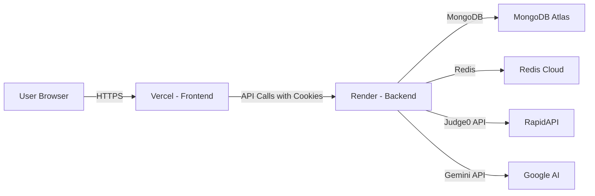

# ZenCode — Comprehensive Project Report

> A full-stack LeetCode-style competitive coding platform with AI-powered tutoring, built with **Node.js/Express** backend and **React 19** frontend.

---

## 1. Project Overview

**ZenCode** is an online coding practice platform (similar to LeetCode) where users can:

- **Sign up / Log in** to a personal account
- **Browse** a paginated catalog of curated DSA problems
- **Solve** problems in an IDE-like interface with a built-in code editor
- **Run** code against visible test cases for instant feedback
- **Submit** code against hidden test cases for final evaluation via **Judge0**
- **Chat** with an AI tutor (Google Gemini) scoped to the current problem
- **Track** progress on a profile dashboard with animated statistics
- **Admin** users can create, update, and delete problems

### Live Deployment

| Layer | Platform | URL |
|-------|----------|-----|
| Frontend | **Vercel** | `https://zencode-project.vercel.app` |
| Backend | **Render** | Configured via `VITE_API_BASE_URL` env |
| Database | **MongoDB Atlas** | Cluster on `cluster0.k275vhl.mongodb.net` |
| Cache | **Redis Cloud** | `redis-15582.crce263.ap-south-1-1.ec2.cloud.redislabs.com` |

---

## 2. Technology Stack

### Backend

| Tool / Library | Version | Purpose |
|----------------|---------|---------|
| **Node.js** | 22.x | Runtime |
| **Express** | 5.2.1 | HTTP framework |
| **Mongoose** | 9.1.2 | MongoDB ODM |
| **Redis** (`redis` npm) | 5.10.0 | JWT blacklist store |
| **bcrypt** | 6.0.0 | Password hashing |
| **jsonwebtoken** | 9.0.3 | Stateless auth tokens |
| **Axios** | 1.13.2 | HTTP client for Judge0 API |
| **@google/genai** | 1.42.0 | Gemini AI integration |
| **dotenv** | 17.2.3 | Environment variables |
| **cookie-parser** | 1.4.7 | Parse HTTP cookies |
| **cors** | 2.8.5 | Cross-origin support |
| **validator** | 13.15.26 | Email / password validation |
| **nodemon** | 3.1.11 (dev) | Hot reload in development |

### Frontend

| Tool / Library | Version | Purpose |
|----------------|---------|---------|
| **React** | 19.2.3 | UI library |
| **Vite** | 7.2.4 | Build tool & dev server |
| **TailwindCSS** | 4.1.18 | Utility-first CSS |
| **DaisyUI** | 5.5.14 | Tailwind component library |
| **Redux Toolkit** | 2.11.2 | Global state management |
| **React Router** | 7.12.0 | Client-side routing |
| **Monaco Editor** (`@monaco-editor/react`) | 4.7.0 | In-browser code editor |
| **GSAP** | 3.13.0 | Complex animations |
| **Motion** (Framer Motion) | 12.26.2 | Declarative animations |
| **React Hook Form** | 7.71.1 | Form management |
| **Zod** | 4.3.5 | Schema-based form validation |
| **Axios** | 1.13.2 | HTTP client |
| **React Markdown** | 10.1.0 | Markdown rendering in chatbot |
| **react-resizable-panels** | 4.5.3 | IDE-style resizable layout |
| **Lucide React** / **Heroicons** / **Tabler Icons** | various | Icon libraries |

### External APIs

| API | Provider | Purpose |
|-----|----------|---------|
| **Judge0** | RapidAPI (`judge029.p.rapidapi.com`) | Remote code execution & evaluation |
| **Gemini** | Google (`@google/genai`) | AI-powered DSA tutoring chatbot |

---

## 3. Backend Architecture

### 3.1 Entry Point — [index.js](file:///c:/Users/roys7/OneDrive/Desktop/ZenCode/Backend/src/index.js)

The server bootstrap does the following in order:
1. Loads environment variables ([.env](file:///c:/Users/roys7/OneDrive/Desktop/ZenCode/Backend/.env))
2. Creates an Express app with `trust proxy` enabled (for Render deployment)
3. Registers middleware: `express.json()`, `cookie-parser`, `cors`
4. Connects to **Redis Cloud** → then **MongoDB Atlas** → then starts listening on `PORT`
5. Mounts four route modules:

| Mount Point | Router Module | Purpose |
|-------------|--------------|---------|
| `/user` | [auth.routes.js](file:///c:/Users/roys7/OneDrive/Desktop/ZenCode/Backend/src/routes/auth.routes.js) | Authentication & user management |
| `/problem` | [problem.routes.js](file:///c:/Users/roys7/OneDrive/Desktop/ZenCode/Backend/src/routes/problem.routes.js) | Problem CRUD & user progress |
| `/submission` | [submission.routes.js](file:///c:/Users/roys7/OneDrive/Desktop/ZenCode/Backend/src/routes/submission.routes.js) | Code run & submit |
| `/ai` | [ai.routes.js](file:///c:/Users/roys7/OneDrive/Desktop/ZenCode/Backend/src/routes/ai.routes.js) | AI chatbot proxy |

#### Key function: [connection()](file:///c:/Users/roys7/OneDrive/Desktop/ZenCode/Backend/src/index.js#28-47)
- Connects Redis and MongoDB sequentially with try/catch for each
- Starts the HTTP server even if Redis fails (graceful degradation)

---

### 3.2 Configuration

#### [database.js](file:///c:/Users/roys7/OneDrive/Desktop/ZenCode/Backend/src/config/database.js)
- **[dbConnection()](file:///c:/Users/roys7/OneDrive/Desktop/ZenCode/Backend/src/config/database.js#9-12)** — Connects to MongoDB Atlas using `mongoose.connect(process.env.DB_URL)`
- Database name: `LeetLab` (configured in the connection string)

#### [redis.js](file:///c:/Users/roys7/OneDrive/Desktop/ZenCode/Backend/src/config/redis.js)
- Creates a Redis client connected to **Redis Cloud** (AWS `ap-south-1-1`)
- Used exclusively for **JWT blacklisting** — when a user logs out, their token is stored in Redis with an expiry matching the JWT's `exp` claim

---

### 3.3 Database Models (Mongoose Schemas)

#### 3.3.1 User Model — [user.js](file:///c:/Users/roys7/OneDrive/Desktop/ZenCode/Backend/src/model/user.js)

| Field | Type | Constraints |
|-------|------|-------------|
| `firstname` | String | Required, 2–10 chars, trimmed |
| `lastname` | String | 2–10 chars, trimmed |
| [age](file:///c:/Users/roys7/OneDrive/Desktop/ZenCode/Frontend/src/pages/Homepage.jsx#10-361) | Number | Min 6, Max 60 |
| `emailId` | String | Required, unique, immutable, lowercase |
| `password` | String | Required, min 8 chars (stored as bcrypt hash) |
| `role` | String | Enum: `"user"`, `"admin"` (default: `"user"`) |
| `gender` | String | Enum: `"male"`, `"female"`, `"others"` |
| `problemSolved` | Array of ObjectIds | References [problem](file:///c:/Users/roys7/OneDrive/Desktop/ZenCode/Backend/src/controllers/problem.controller.js#98-125) collection |

- **Timestamps** enabled (`createdAt`, `updatedAt`)
- `problemSolved` provides a quick lookup for profile stats without querying submissions

#### 3.3.2 Problem Model — [problem.js](file:///c:/Users/roys7/OneDrive/Desktop/ZenCode/Backend/src/model/problem.js)

| Field | Type | Description |
|-------|------|-------------|
| `title` | String | Problem title |
| `difficulty` | String | `"easy"` / `"medium"` / `"hard"` |
| `tags` | [String] | DSA topic tags (e.g., `"array"`, `"binary-search"`) |
| `companies` | [String] | Companies that ask this problem |
| `description` | String | Full problem statement (supports Markdown) |
| `examples` | Array | `{ input, output, explanation }` — shown in the UI |
| `visibleTestCase` | Array | `{ input, output }` — used for "Run" |
| `hiddenTestCase` | Array | `{ input, output }` — used for "Submit" |
| `initialCode` | Array | `{ language, code }` — starter templates per language |
| `driverCode` | Array | `{ language, prefix, suffix }` — Judge0 wrapper code |
| `referenceSolution` | Array | `{ language, solution }` — validated on creation |
| `problemCreator` | ObjectId | Ref to the admin who created it |
| `editorial` | String | Optional solution explanation |
| `acceptedSubmissions` | Number | Counter for accepted subs |
| `totalSubmissions` | Number | Counter for all subs |
| `acceptanceRate` | Number | Calculated acceptance percentage |

#### 3.3.3 Submission Model — [submission.js](file:///c:/Users/roys7/OneDrive/Desktop/ZenCode/Backend/src/model/submission.js)

| Field | Type | Description |
|-------|------|-------------|
| `userId` | ObjectId | Ref to user |
| `problemId` | ObjectId | Ref to problem |
| [code](file:///c:/Users/roys7/OneDrive/Desktop/ZenCode/Backend/src/utils/problem.utils.js#48-59) | String | The submitted source code |
| `language` | String | `"javascript"` / `"cpp"` / `"java"` / `"python"` |
| `status` | String | `"pending"` / `"accepted"` / `"wrong_answer"` / `"runtime_error"` / `"compilation_error"` / `"time_limit_exceeded"` |
| `runtime` | Number | Total execution time (seconds) |
| `memory` | Number | Peak memory usage (KB) |
| `errorMessage` | String | Error details if any |
| `testCasesPassed` | Number | Count of passed test cases |
| `testCasesTotal` | Number | Total test cases |

- **Timestamps** enabled
- **Compound indexes** on `{ userId, problemId }` and `{ userId, createdAt: -1 }` for efficient queries

---

### 3.4 Middleware

#### [auth.middleware.js](file:///c:/Users/roys7/OneDrive/Desktop/ZenCode/Backend/src/middleware/auth.middleware.js) — [authMiddleware](file:///c:/Users/roys7/OneDrive/Desktop/ZenCode/Backend/src/middleware/auth.middleware.js#11-37)
1. Extracts JWT from `req.cookies.token`
2. Checks Redis for blacklisted tokens (logged-out users)
3. Verifies the JWT signature with `process.env.JWT_SECRET`
4. Loads the full user document from MongoDB
5. Attaches `req.userId` and `req.result` (user object) for downstream handlers

#### [admin.middleware.js](file:///c:/Users/roys7/OneDrive/Desktop/ZenCode/Backend/src/middleware/admin.middleware.js) — [adminMiddleware](file:///c:/Users/roys7/OneDrive/Desktop/ZenCode/Backend/src/middleware/admin.middleware.js#10-34)
- Same as [authMiddleware](file:///c:/Users/roys7/OneDrive/Desktop/ZenCode/Backend/src/middleware/auth.middleware.js#11-37) but additionally checks `decoded.role === "admin"`
- Used to protect problem CRUD endpoints

---

### 3.5 Controllers (Every Function Explained)

#### 3.5.1 UserAuth Controller — [UserAuth.controller.js](file:///c:/Users/roys7/OneDrive/Desktop/ZenCode/Backend/src/controllers/UserAuth.controller.js)

| Function | Route | Description |
|----------|-------|-------------|
| **[registerUser](file:///c:/Users/roys7/OneDrive/Desktop/ZenCode/Backend/src/controllers/UserAuth.controller.js#13-51)** | `POST /user/register` | Validates input via [authValidate()](file:///c:/Users/roys7/OneDrive/Desktop/ZenCode/Backend/src/utils/authValidator.js#5-55), forces `role: "user"`, hashes password with bcrypt (10 rounds), creates user in MongoDB, mints a 1-hour JWT, sets it as an `httpOnly` cookie, returns user data |
| **[loginUser](file:///c:/Users/roys7/OneDrive/Desktop/ZenCode/Backend/src/controllers/UserAuth.controller.js#52-95)** | `POST /user/login` | Finds user by email, compares password with bcrypt, mints JWT, sets cookie, returns user data |
| **[logoutUser](file:///c:/Users/roys7/OneDrive/Desktop/ZenCode/Backend/src/controllers/UserAuth.controller.js#96-121)** | `POST /user/logout` | Decodes the JWT to get `exp` time, stores the token in Redis with key `token:{jwt}` and TTL matching the JWT expiry (blacklisting), clears the cookie |
| **[adminRegister](file:///c:/Users/roys7/OneDrive/Desktop/ZenCode/Backend/src/controllers/UserAuth.controller.js#122-146)** | `POST /user/admin/register` | Same as [registerUser](file:///c:/Users/roys7/OneDrive/Desktop/ZenCode/Backend/src/controllers/UserAuth.controller.js#13-51) but sets `role: "admin"`. Protected by [adminMiddleware](file:///c:/Users/roys7/OneDrive/Desktop/ZenCode/Backend/src/middleware/admin.middleware.js#10-34) |
| **[deleteUser](file:///c:/Users/roys7/OneDrive/Desktop/ZenCode/Backend/src/controllers/UserAuth.controller.js#147-170)** | `DELETE /user/delete/:id` | Validates user exists, deletes all their submissions (`submission.deleteMany`), then deletes the user document |
| **[updateProfile](file:///c:/Users/roys7/OneDrive/Desktop/ZenCode/Backend/src/controllers/UserAuth.controller.js#171-203)** | `PATCH /user/profile` | Updates `firstname`, `lastname`, [age](file:///c:/Users/roys7/OneDrive/Desktop/ZenCode/Frontend/src/pages/Homepage.jsx#10-361), `gender` only. Email is immutable. Returns the updated user |
| **[resetPassword](file:///c:/Users/roys7/OneDrive/Desktop/ZenCode/Backend/src/controllers/UserAuth.controller.js#204-231)** | `POST /user/reset-password` | Verifies old password with bcrypt, hashes the new password, saves to DB |

**Cookie Configuration** (production-safe):
- `httpOnly: true` — prevents XSS access
- `sameSite: "none"` in production (for cross-origin Vercel ↔ Render)
- `secure: true` in production (HTTPS only)
- `maxAge: 1 hour`

#### 3.5.2 Problem Controller — [problem.controller.js](file:///c:/Users/roys7/OneDrive/Desktop/ZenCode/Backend/src/controllers/problem.controller.js)

| Function | Route | Description |
|----------|-------|-------------|
| **[createProblem](file:///c:/Users/roys7/OneDrive/Desktop/ZenCode/Backend/src/controllers/problem.controller.js#7-59)** | `POST /problem/create` | Admin-only. If `referenceSolution` is provided, validates it by running it through Judge0 against visible test cases. Only saves the problem if all test cases pass. |
| **[getProblemById](file:///c:/Users/roys7/OneDrive/Desktop/ZenCode/Backend/src/controllers/problem.controller.js#60-97)** | `GET /problem/problemById/:id` | Returns full problem data (description, examples, initial code, test cases, editorial) for the solving page |
| **[problemFetchAll](file:///c:/Users/roys7/OneDrive/Desktop/ZenCode/Backend/src/controllers/problem.controller.js#98-125)** | `GET /problem/getAllProblems?page=N` | Returns paginated list (15 per page) with `title`, `_id`, `difficulty`, `tags`. Returns `currentPage`, `totalPages`, and `hasMore` flag |
| **[updateProblem](file:///c:/Users/roys7/OneDrive/Desktop/ZenCode/Backend/src/controllers/problem.controller.js#126-184)** | `PUT /problem/update/:id` | Admin-only. Re-validates reference solution via Judge0 if both solution and test cases are present in the update payload |
| **[solvedProblemByUser](file:///c:/Users/roys7/OneDrive/Desktop/ZenCode/Backend/src/controllers/problem.controller.js#185-211)** | `GET /problem/user` | Returns the authenticated user's `problemSolved` array (populated with title, difficulty, tags) and the count |
| **[deleteProblem](file:///c:/Users/roys7/OneDrive/Desktop/ZenCode/Backend/src/controllers/problem.controller.js#212-235)** | `DELETE /problem/delete/:id` | Admin-only. Deletes a problem by ID |
| **[getSubmission](file:///c:/Users/roys7/OneDrive/Desktop/ZenCode/Backend/src/controllers/problem.controller.js#236-258)** | `GET /problem/submission/:id` | Returns all submissions for the auth user on a specific problem, sorted by newest first |
| **[cleanupOrphanedData](file:///c:/Users/roys7/OneDrive/Desktop/ZenCode/Backend/src/controllers/problem.controller.js#259-275)** | `DELETE /problem/cleanup` | Admin dev utility. Clears all `problemSolved` arrays and deletes all submissions |

#### 3.5.3 Submission Controller — [submission.controller.js](file:///c:/Users/roys7/OneDrive/Desktop/ZenCode/Backend/src/controllers/submission.controller.js)

| Function | Route | Description |
|----------|-------|-------------|
| **[submitCode](file:///c:/Users/roys7/OneDrive/Desktop/ZenCode/Backend/src/controllers/submission.controller.js#26-108)** | `POST /submission/submit/:id` | Creates a "pending" submission record → runs code through Judge0 against **hidden** test cases → evaluates all results → updates status to `accepted`/`wrong_answer`/`runtime_error` → adds problem to user's `problemSolved` if accepted → saves submission with runtime/memory stats |
| **[runCode](file:///c:/Users/roys7/OneDrive/Desktop/ZenCode/Backend/src/controllers/submission.controller.js#109-156)** | `POST /submission/run/:id` | Runs code against **visible** test cases only → does NOT create a submission record → does NOT update user progress → returns detailed per-test-case results for instant IDE feedback |
| **[getSubmission](file:///c:/Users/roys7/OneDrive/Desktop/ZenCode/Backend/src/controllers/problem.controller.js#236-258)** | `GET /submission/getSubmission/:id` | Returns submission history for the user on a specific problem |

**[mapJudgeStatus(statusId)](file:///c:/Users/roys7/OneDrive/Desktop/ZenCode/Backend/src/controllers/submission.controller.js#7-25)** — Helper that maps Judge0 status codes: `3 → accepted`, `4 → wrong_answer`, `5 → time_limit_exceeded`, `6 → compilation_error`, default → `runtime_error`

#### 3.5.4 AI Controller — [ai.controller.js](file:///c:/Users/roys7/OneDrive/Desktop/ZenCode/Backend/src/controllers/ai.controller.js)

| Function | Route | Description |
|----------|-------|-------------|
| **[generateChatReply](file:///c:/Users/roys7/OneDrive/Desktop/ZenCode/Backend/src/controllers/ai.controller.js#42-97)** | `POST /ai/chat` | Proxies AI chat through the backend. Receives `messages`, `prompt`, [code](file:///c:/Users/roys7/OneDrive/Desktop/ZenCode/Backend/src/utils/problem.utils.js#48-59), `language`, `problemTitle`, `problemDescription`. Calls Google Gemini with conversation history and a strict DSA-only system prompt. Returns the AI's reply. |

**[sanitizeMessages(messages)](file:///c:/Users/roys7/OneDrive/Desktop/ZenCode/Backend/src/controllers/ai.controller.js#26-41)** — Filters and maps the conversation history to Gemini's expected format (`role: "model"` for assistant, `parts: [{ text }]`)

**System Instruction** — The AI is instructed to:
1. Only discuss DSA topics
2. Never give full solutions upfront (Socratic method)
3. Walk users through approaches step-by-step
4. Only reveal complete code when explicitly asked
5. Format responses in Markdown

---

### 3.6 Utilities

#### [authValidator.js](file:///c:/Users/roys7/OneDrive/Desktop/ZenCode/Backend/src/utils/authValidator.js) — [authValidate(data)](file:///c:/Users/roys7/OneDrive/Desktop/ZenCode/Backend/src/utils/authValidator.js#5-55)

Validates registration payloads:
- Checks mandatory fields: `firstname`, `password`, `emailId`
- Validates `firstname` length (2–10)
- Validates `lastname` length if present
- Validates [age](file:///c:/Users/roys7/OneDrive/Desktop/ZenCode/Frontend/src/pages/Homepage.jsx#10-361) range (6–60) if present
- Validates `gender` against allowed values
- Uses the `validator` library for `isStrongPassword()` and `isEmail()`

#### [problem.utils.js](file:///c:/Users/roys7/OneDrive/Desktop/ZenCode/Backend/src/utils/problem.utils.js) — Judge0 Integration

This is the core bridge to the **Judge0** code execution API. All code evaluation flows through these functions:

| Function | Description |
|----------|-------------|
| **[getLanguageId(lang)](file:///c:/Users/roys7/OneDrive/Desktop/ZenCode/Backend/src/utils/problem.utils.js#23-37)** | Maps language strings to Judge0 IDs: `cpp→54`, `java→62`, `javascript→63`, `python→71` |
| **[encodeBase64Value(value)](file:///c:/Users/roys7/OneDrive/Desktop/ZenCode/Backend/src/utils/problem.utils.js#40-47)** | Encodes a string to base64 for safe transmission to Judge0 |
| **[decodeBase64Value(value)](file:///c:/Users/roys7/OneDrive/Desktop/ZenCode/Backend/src/utils/problem.utils.js#48-59)** | Decodes base64 responses back to UTF-8 |
| **[decodeJudgeResult(result)](file:///c:/Users/roys7/OneDrive/Desktop/ZenCode/Backend/src/utils/problem.utils.js#60-67)** | Decodes `stdout`, `stderr`, `compile_output`, and `message` from a Judge0 response |
| **[submitBatch(submissions, retries)](file:///c:/Users/roys7/OneDrive/Desktop/ZenCode/Backend/src/utils/problem.utils.js#68-117)** | Submits an array of code executions to Judge0's batch endpoint. Encodes all payloads to base64. Retries on 429 rate-limit errors with exponential backoff (attempt × 2 seconds). Default: 3 retries. |
| **[submitToken(tokens, maxRetries)](file:///c:/Users/roys7/OneDrive/Desktop/ZenCode/Backend/src/utils/problem.utils.js#118-189)** | Polls Judge0's batch GET endpoint until all submissions finish (`status_id > 2`). Uses exponential backoff: starts at 2s, increments by 2s, caps at 5s. Default: 18 poll retries. |
| **[executeCodeAndEvaluate(code, langId, testCases)](file:///c:/Users/roys7/OneDrive/Desktop/ZenCode/Backend/src/utils/problem.utils.js#190-258)** | The main orchestrator: (1) Prepares Judge0 submissions from test cases, (2) Calls [submitBatch()](file:///c:/Users/roys7/OneDrive/Desktop/ZenCode/Backend/src/utils/problem.utils.js#68-117), (3) Extracts tokens, (4) Polls with [submitToken()](file:///c:/Users/roys7/OneDrive/Desktop/ZenCode/Backend/src/utils/problem.utils.js#118-189), (5) Returns mapped results with `input`, `expectedOutput`, `actualOutput`, `status`, `error`, `time`, `memory` |

**Environment-configurable constants:**
- `JUDGE0_SUBMIT_RETRIES` (default 3)
- `JUDGE0_MAX_POLL_RETRIES` (default 18)
- `JUDGE0_INITIAL_POLL_DELAY_MS` (default 2000)
- `JUDGE0_POLL_INTERVAL_MS` (default 2000)
- `JUDGE0_MAX_POLL_INTERVAL_MS` (default 5000)

---

### 3.7 Routes Summary

#### Auth Routes — [auth.routes.js](file:///c:/Users/roys7/OneDrive/Desktop/ZenCode/Backend/src/routes/auth.routes.js)

| Method | Path | Middleware | Handler |
|--------|------|-----------|---------|
| POST | `/user/login` | — | [loginUser](file:///c:/Users/roys7/OneDrive/Desktop/ZenCode/Backend/src/controllers/UserAuth.controller.js#52-95) |
| POST | `/user/register` | — | [registerUser](file:///c:/Users/roys7/OneDrive/Desktop/ZenCode/Backend/src/controllers/UserAuth.controller.js#13-51) |
| POST | `/user/logout` | [authMiddleware](file:///c:/Users/roys7/OneDrive/Desktop/ZenCode/Backend/src/middleware/auth.middleware.js#11-37) | [logoutUser](file:///c:/Users/roys7/OneDrive/Desktop/ZenCode/Backend/src/controllers/UserAuth.controller.js#96-121) |
| POST | `/user/admin/register` | [adminMiddleware](file:///c:/Users/roys7/OneDrive/Desktop/ZenCode/Backend/src/middleware/admin.middleware.js#10-34) | [adminRegister](file:///c:/Users/roys7/OneDrive/Desktop/ZenCode/Backend/src/controllers/UserAuth.controller.js#122-146) |
| DELETE | `/user/delete/:id` | [authMiddleware](file:///c:/Users/roys7/OneDrive/Desktop/ZenCode/Backend/src/middleware/auth.middleware.js#11-37) | [deleteUser](file:///c:/Users/roys7/OneDrive/Desktop/ZenCode/Backend/src/controllers/UserAuth.controller.js#147-170) |
| PATCH | `/user/profile` | [authMiddleware](file:///c:/Users/roys7/OneDrive/Desktop/ZenCode/Backend/src/middleware/auth.middleware.js#11-37) | [updateProfile](file:///c:/Users/roys7/OneDrive/Desktop/ZenCode/Backend/src/controllers/UserAuth.controller.js#171-203) |
| POST | `/user/reset-password` | [authMiddleware](file:///c:/Users/roys7/OneDrive/Desktop/ZenCode/Backend/src/middleware/auth.middleware.js#11-37) | [resetPassword](file:///c:/Users/roys7/OneDrive/Desktop/ZenCode/Backend/src/controllers/UserAuth.controller.js#204-231) |
| GET | `/user/check` | [authMiddleware](file:///c:/Users/roys7/OneDrive/Desktop/ZenCode/Backend/src/middleware/auth.middleware.js#11-37) | Inline — returns current user data |

#### Problem Routes — [problem.routes.js](file:///c:/Users/roys7/OneDrive/Desktop/ZenCode/Backend/src/routes/problem.routes.js)

| Method | Path | Middleware | Handler |
|--------|------|-----------|---------|
| POST | `/problem/create` | [adminMiddleware](file:///c:/Users/roys7/OneDrive/Desktop/ZenCode/Backend/src/middleware/admin.middleware.js#10-34) | [createProblem](file:///c:/Users/roys7/OneDrive/Desktop/ZenCode/Backend/src/controllers/problem.controller.js#7-59) |
| PUT | `/problem/update/:id` | [adminMiddleware](file:///c:/Users/roys7/OneDrive/Desktop/ZenCode/Backend/src/middleware/admin.middleware.js#10-34) | [updateProblem](file:///c:/Users/roys7/OneDrive/Desktop/ZenCode/Backend/src/controllers/problem.controller.js#126-184) |
| DELETE | `/problem/delete/:id` | [adminMiddleware](file:///c:/Users/roys7/OneDrive/Desktop/ZenCode/Backend/src/middleware/admin.middleware.js#10-34) | [deleteProblem](file:///c:/Users/roys7/OneDrive/Desktop/ZenCode/Backend/src/controllers/problem.controller.js#212-235) |
| DELETE | `/problem/cleanup` | [adminMiddleware](file:///c:/Users/roys7/OneDrive/Desktop/ZenCode/Backend/src/middleware/admin.middleware.js#10-34) | [cleanupOrphanedData](file:///c:/Users/roys7/OneDrive/Desktop/ZenCode/Backend/src/controllers/problem.controller.js#259-275) |
| GET | `/problem/user` | [authMiddleware](file:///c:/Users/roys7/OneDrive/Desktop/ZenCode/Backend/src/middleware/auth.middleware.js#11-37) | [solvedProblemByUser](file:///c:/Users/roys7/OneDrive/Desktop/ZenCode/Backend/src/controllers/problem.controller.js#185-211) |
| GET | `/problem/problemById/:id` | [authMiddleware](file:///c:/Users/roys7/OneDrive/Desktop/ZenCode/Backend/src/middleware/auth.middleware.js#11-37) | [getProblemById](file:///c:/Users/roys7/OneDrive/Desktop/ZenCode/Backend/src/controllers/problem.controller.js#60-97) |
| GET | `/problem/getAllProblems` | [authMiddleware](file:///c:/Users/roys7/OneDrive/Desktop/ZenCode/Backend/src/middleware/auth.middleware.js#11-37) | [problemFetchAll](file:///c:/Users/roys7/OneDrive/Desktop/ZenCode/Backend/src/controllers/problem.controller.js#98-125) |
| GET | `/problem/submission/:id` | [authMiddleware](file:///c:/Users/roys7/OneDrive/Desktop/ZenCode/Backend/src/middleware/auth.middleware.js#11-37) | [getSubmission](file:///c:/Users/roys7/OneDrive/Desktop/ZenCode/Backend/src/controllers/problem.controller.js#236-258) |

#### Submission Routes — [submission.routes.js](file:///c:/Users/roys7/OneDrive/Desktop/ZenCode/Backend/src/routes/submission.routes.js)

| Method | Path | Middleware | Handler |
|--------|------|-----------|---------|
| POST | `/submission/submit/:id` | [authMiddleware](file:///c:/Users/roys7/OneDrive/Desktop/ZenCode/Backend/src/middleware/auth.middleware.js#11-37) | [submitCode](file:///c:/Users/roys7/OneDrive/Desktop/ZenCode/Backend/src/controllers/submission.controller.js#26-108) |
| POST | `/submission/run/:id` | [authMiddleware](file:///c:/Users/roys7/OneDrive/Desktop/ZenCode/Backend/src/middleware/auth.middleware.js#11-37) | [runCode](file:///c:/Users/roys7/OneDrive/Desktop/ZenCode/Backend/src/controllers/submission.controller.js#109-156) |
| GET | `/submission/getSubmission/:id` | [authMiddleware](file:///c:/Users/roys7/OneDrive/Desktop/ZenCode/Backend/src/middleware/auth.middleware.js#11-37) | [getSubmission](file:///c:/Users/roys7/OneDrive/Desktop/ZenCode/Backend/src/controllers/problem.controller.js#236-258) |

#### AI Routes — [ai.routes.js](file:///c:/Users/roys7/OneDrive/Desktop/ZenCode/Backend/src/routes/ai.routes.js)

| Method | Path | Middleware | Handler |
|--------|------|-----------|---------|
| POST | `/ai/chat` | [authMiddleware](file:///c:/Users/roys7/OneDrive/Desktop/ZenCode/Backend/src/middleware/auth.middleware.js#11-37) | [generateChatReply](file:///c:/Users/roys7/OneDrive/Desktop/ZenCode/Backend/src/controllers/ai.controller.js#42-97) |

---

## 4. Frontend Architecture

### 4.1 Bootstrap — [main.jsx](file:///c:/Users/roys7/OneDrive/Desktop/ZenCode/Frontend/src/main.jsx)

Wraps the app in three providers:
1. **`<Provider store={store}>`** — Redux store
2. **`<StrictMode>`** — React strict mode
3. **`<BrowserRouter>`** — Client-side routing

### 4.2 Root App — [App.jsx](file:///c:/Users/roys7/OneDrive/Desktop/ZenCode/Frontend/src/App.jsx)

| Feature | Implementation |
|---------|---------------|
| **Backend Wake Detection** | On Render deploys, polls the backend root `/` endpoint every 3 seconds until alive. Shows `BackendWakeScreen` with countdown timer during cold start (~60s). |
| **Session Restoration** | On boot, dispatches `checkAuth()` thunk to verify the cookie is still valid |
| **Route Guards** | Authenticated users get redirected away from `/login` and `/signup`. Unauthenticated users get redirected to `/login` for protected pages. |

**[pingBackendHealth()](file:///c:/Users/roys7/OneDrive/Desktop/ZenCode/Frontend/src/App.jsx#29-48)** — Fetches the backend root URL with a 5s timeout. Returns `true` if `response.ok`.

#### Routes

| Path | Component | Auth Required |
|------|-----------|---------------|
| `/` | [Homepage](file:///c:/Users/roys7/OneDrive/Desktop/ZenCode/Frontend/src/pages/Homepage.jsx#10-361) | No |
| `/login` | [Loginpage](file:///c:/Users/roys7/OneDrive/Desktop/ZenCode/Frontend/src/pages/Loginpage.jsx#20-213) | No (redirects if logged in) |
| `/signup` | [Signupform](file:///c:/Users/roys7/OneDrive/Desktop/ZenCode/Frontend/src/pages/Signupform.jsx#26-203) | No (redirects if logged in) |
| `/problemset` | [Problemset](file:///c:/Users/roys7/OneDrive/Desktop/ZenCode/Frontend/src/pages/Problemset.jsx#51-548) | Yes |
| `/admin` | `Adminpage` | Yes |
| `/profile` | [Profile](file:///c:/Users/roys7/OneDrive/Desktop/ZenCode/Frontend/src/pages/Profile.jsx#23-591) | Yes |
| `/problem/:id` | [Problempage](file:///c:/Users/roys7/OneDrive/Desktop/ZenCode/Frontend/src/pages/Problempage.jsx#13-379) | Yes |

### 4.3 State Management

#### Redux Store — [store.js](file:///c:/Users/roys7/OneDrive/Desktop/ZenCode/Frontend/src/store/store.js)
Single slice: [auth](file:///c:/Users/roys7/OneDrive/Desktop/ZenCode/Backend/src/utils/authValidator.js#5-55)

#### Auth Slice — [authSlice.js](file:///c:/Users/roys7/OneDrive/Desktop/ZenCode/Frontend/src/authSlice.js)

**State shape:**
```js
{ user: null, isAuthenticated: false, loading: true, error: null }
```

**Async Thunks:**

| Thunk | API Call | Purpose |
|-------|----------|---------|
| [registerUser](file:///c:/Users/roys7/OneDrive/Desktop/ZenCode/Backend/src/controllers/UserAuth.controller.js#13-51) | `POST /user/register` | Create account & establish session |
| [loginUser](file:///c:/Users/roys7/OneDrive/Desktop/ZenCode/Backend/src/controllers/UserAuth.controller.js#52-95) | `POST /user/login` | Sign in & establish session |
| `checkAuth` | `GET /user/check` | Restore session from existing cookie |
| [logoutUser](file:///c:/Users/roys7/OneDrive/Desktop/ZenCode/Backend/src/controllers/UserAuth.controller.js#96-121) | `POST /user/logout` | Invalidate session |
| [updateProfile](file:///c:/Users/roys7/OneDrive/Desktop/ZenCode/Backend/src/controllers/UserAuth.controller.js#171-203) | `PATCH /user/profile` | Edit name fields |
| [resetPassword](file:///c:/Users/roys7/OneDrive/Desktop/ZenCode/Backend/src/controllers/UserAuth.controller.js#204-231) | `POST /user/reset-password` | Change password |

Each thunk has `pending/fulfilled/rejected` handlers that update `loading`, `user`, `isAuthenticated`, and `error`.

#### Axios Client — [axiosClient.js](file:///c:/Users/roys7/OneDrive/Desktop/ZenCode/Frontend/src/utils/axiosClient.js)
- Base URL from `VITE_API_BASE_URL` env var (defaults to `http://localhost:3000`)
- `withCredentials: true` — sends cookies with every request (critical for cookie-based auth)

#### Submission API — [submission.js](file:///c:/Users/roys7/OneDrive/Desktop/ZenCode/Frontend/src/api/submission.js)

| Function | API Call | Purpose |
|----------|----------|---------|
| [runCodeApi(problemId, code, language)](file:///c:/Users/roys7/OneDrive/Desktop/ZenCode/Frontend/src/api/submission.js#5-24) | `POST /submission/run/:id` | Quick run against visible tests |
| [submitCodeApi(problemId, code, language)](file:///c:/Users/roys7/OneDrive/Desktop/ZenCode/Frontend/src/api/submission.js#25-44) | `POST /submission/submit/:id` | Final submit against hidden tests |
| [getSubmissionsApi(problemId)](file:///c:/Users/roys7/OneDrive/Desktop/ZenCode/Frontend/src/api/submission.js#45-59) | `GET /submission/getSubmission/:id` | Load submission history |

---

### 4.4 Pages (Every Page Explained)

#### 4.4.1 Homepage — [Homepage.jsx](file:///c:/Users/roys7/OneDrive/Desktop/ZenCode/Frontend/src/pages/Homepage.jsx)

The public landing page. Purely presentational with rich animations:

- **GSAP animations** — Hero text reveals with `fromTo` stagger on class `.hero-reveal`, hero card scales in
- **Framer Motion** — Stats cards and feature sections animate on scroll using `whileInView`
- **Gradient background** — Custom AI background image with overlay gradients
- **Sections**: Hero CTA, Stats (Active Learners, Solutions Reviewed, Hiring Partners), Structured Practice, AI Pro Tools showcase (Mock Interviewer, Smart Resume Maker, Adaptive Aptitude), FAQ accordion, Join CTA, Footer

#### 4.4.2 Loginpage — [Loginpage.jsx](file:///c:/Users/roys7/OneDrive/Desktop/ZenCode/Frontend/src/pages/Loginpage.jsx)

- **Form validation** with Zod schema (`email` + `password min 8 chars`)
- **React Hook Form** with `zodResolver` for validation binding
- **Password visibility toggle** with Heroicons eye/slash icons
- **Toast system** — Custom floating toast for success/error messages with auto-dismiss (3.2s)
- Receives logout toast via `location.state` from the nav
- Shows "Continue with Google" and "Continue with GitHub" buttons (UI-only, not yet integrated)
- Dispatches [loginUser](file:///c:/Users/roys7/OneDrive/Desktop/ZenCode/Backend/src/controllers/UserAuth.controller.js#52-95) thunk and navigates to `/problemset` on success

#### 4.4.3 Signupform — [Signupform.jsx](file:///c:/Users/roys7/OneDrive/Desktop/ZenCode/Frontend/src/pages/Signupform.jsx)

- **Zod schema** with password confirmation refinement (`.refine()`)
- Fields: `firstname`, `lastname`, `emailId`, `password`, `confirmedPassword`
- Strips `confirmedPassword` before dispatching [registerUser](file:///c:/Users/roys7/OneDrive/Desktop/ZenCode/Backend/src/controllers/UserAuth.controller.js#13-51)
- Same split-panel layout as login with branding panel
- Shows Redux `error` state directly in the form

#### 4.4.4 Problemset — [Problemset.jsx](file:///c:/Users/roys7/OneDrive/Desktop/ZenCode/Frontend/src/pages/Problemset.jsx)

The problem catalog with advanced grouping and progress tracking:

- **Data fetching**: Auto-paginates through all problem pages (`while(hasMore)`) to build the full list
- **Solved progress**: Fetches user's solved problems from `/problem/user` and builds a lookup map
- **Topic grouping**: Groups problems by tags using `useMemo`, then sub-groups by difficulty (easy/medium/hard)
- **Accordion UI**: Nested collapsible sections — Topic → Difficulty → Problem cards
- **Stats bar**: Shows total, easy, medium, hard counts + overall progress percentage with animated progress bar
- **Admin features**: "Admin Panel" button (if user.role is admin), "Delete" button on each problem
- **Random question**: Opens a random problem from the list
- **Bookmark/Favorite**: Client-side toggle (not persisted)
- **Solved badges**: Green checkmark and "Solved" label on solved problems

**Key functions:**
- [toTopicArray(tags)](file:///c:/Users/roys7/OneDrive/Desktop/ZenCode/Frontend/src/pages/Problemset.jsx#25-33) — Normalizes tags to an array, deduplicates, defaults to "Uncategorized"
- [handleDeleteProblem(id, title)](file:///c:/Users/roys7/OneDrive/Desktop/ZenCode/Frontend/src/pages/Problemset.jsx#244-274) — Confirms then calls `DELETE /problem/delete/:id`
- [toggleTopic(key)](file:///c:/Users/roys7/OneDrive/Desktop/ZenCode/Frontend/src/pages/Problemset.jsx#235-238) / [toggleDifficultyGroup(key, level)](file:///c:/Users/roys7/OneDrive/Desktop/ZenCode/Frontend/src/pages/Problemset.jsx#239-243) — Accordion state managers
- [handleOpenRandomQuestion()](file:///c:/Users/roys7/OneDrive/Desktop/ZenCode/Frontend/src/pages/Problemset.jsx#221-230) — Picks a random problem and navigates

#### 4.4.5 Problempage — [Problempage.jsx](file:///c:/Users/roys7/OneDrive/Desktop/ZenCode/Frontend/src/pages/Problempage.jsx)

The IDE-style problem solving experience. The most complex page:

- **Three-panel layout** using `react-resizable-panels`:
  - **Left (40%)**: Problem description, examples, editorial via `LeftPanel`
  - **Upper Right (65%)**: Code editor via `UpperRightPanel` (Monaco Editor)
  - **Bottom Right (35%)**: Test results output via `BottomRight`
- **IDE Navbar**: Logo, Problem List button, Previous/Next problem navigation, Run/Submit buttons, Timer
- **Language switching**: When language changes, auto-loads the corresponding `initialCode` template
- **Problem sequence**: Fetches all problem IDs to enable previous/next navigation
- **Submission popup**: Floating card showing result status, test cases passed, runtime, memory, errors

**Key functions:**
- [handleRun()](file:///c:/Users/roys7/OneDrive/Desktop/ZenCode/Frontend/src/pages/Problempage.jsx#126-139) — Calls [runCodeApi()](file:///c:/Users/roys7/OneDrive/Desktop/ZenCode/Frontend/src/api/submission.js#5-24), shows results in bottom panel
- [handleSubmit()](file:///c:/Users/roys7/OneDrive/Desktop/ZenCode/Frontend/src/pages/Problempage.jsx#140-174) — Calls [submitCodeApi()](file:///c:/Users/roys7/OneDrive/Desktop/ZenCode/Frontend/src/api/submission.js#25-44), shows submission popup with detailed stats
- [getErrorMessage(error, fallback)](file:///c:/Users/roys7/OneDrive/Desktop/ZenCode/Frontend/src/pages/Problemset.jsx#18-24) — Normalizes various error formats to a displayable string

#### 4.4.6 Profile — [Profile.jsx](file:///c:/Users/roys7/OneDrive/Desktop/ZenCode/Frontend/src/pages/Profile.jsx)

User dashboard with animated progress and account management:

- **Progress ring**: SVG circle with GSAP-animated `strokeDashoffset` showing solved percentage
- **Animated counters**: GSAP tweens for solved count and percentage
- **Stats cards**: Problems Solved, Total Problems, Current Streak (placeholder), Days Active (placeholder)
- **Account details card**: Displays name, email, role, join date
- **Edit Profile modal**: Updates firstname/lastname via [updateProfile](file:///c:/Users/roys7/OneDrive/Desktop/ZenCode/Backend/src/controllers/UserAuth.controller.js#171-203) thunk
- **Reset Password modal**: Verifies old password, sets new password via [resetPassword](file:///c:/Users/roys7/OneDrive/Desktop/ZenCode/Backend/src/controllers/UserAuth.controller.js#204-231) thunk
- **Recent solved**: Shows last 5 solved questions with links
- **Auto-refresh**: Polls solved stats every 15 seconds + on window focus/visibility

#### 4.4.7 Adminpage — [Adminpage.jsx](file:///c:/Users/roys7/OneDrive/Desktop/ZenCode/Frontend/src/pages/Adminpage.jsx)

Comprehensive form for creating new problems:

- **Zod schema** with 13+ validated fields
- **React Hook Form** with `useFieldArray` for dynamic sections
- **Form sections**:
  1. Basic Info (title, companies, description, difficulty, constraints)
  2. Tags (15 DSA categories as checkboxes)
  3. Hints (dynamic array)
  4. Examples (dynamic: input, output, explanation)
  5. Test Cases (dynamic: input, expected output)
  6. Initial Code Templates (dynamic: language + code per language)
  7. Driver Code / Judge0 Wrapper (dynamic: language + prefix + suffix)
  8. Editorial (optional Markdown)
  9. Reference Solutions (optional, validated via Judge0 on backend)
- Posts to `POST /problem/create`

---

### 4.5 Components

#### [Navbar.jsx](file:///c:/Users/roys7/OneDrive/Desktop/ZenCode/Frontend/src/components/Navbar.jsx)
- Navigation bar used across all pages
- Shows different links based on auth state

#### [LeftPanel.jsx](file:///c:/Users/roys7/OneDrive/Desktop/ZenCode/Frontend/src/components/LeftPanel.jsx)
- Problem description panel in the IDE view
- Renders description, examples, editorial
- Hosts the AI Chatbot

#### [UpperRightPanel.jsx](file:///c:/Users/roys7/OneDrive/Desktop/ZenCode/Frontend/src/components/UpperRightPanel.jsx)
- Monaco Editor wrapper with language selector
- Passes code changes up to [Problempage](file:///c:/Users/roys7/OneDrive/Desktop/ZenCode/Frontend/src/pages/Problempage.jsx#13-379)

#### [BottomRight.jsx](file:///c:/Users/roys7/OneDrive/Desktop/ZenCode/Frontend/src/components/BottomRight.jsx)
- Displays run/submit results
- Shows test case input/output/status comparisons
- Renders error messages

#### [Chatbot.jsx](file:///c:/Users/roys7/OneDrive/Desktop/ZenCode/Frontend/src/components/Chatbot.jsx)
- AI chat interface embedded in the left panel
- **Messages**: Session-based array (not persisted)
- **Quick actions**: "Give me a hint", "Explain the approach", "Review my code"
- **Sends to backend**: POST `/ai/chat` with full conversation history, current code, language, problem context
- **Rendering**: Uses `react-markdown` for Markdown responses
- **Error boundary**: Class-based [ErrorBoundary](file:///c:/Users/roys7/OneDrive/Desktop/ZenCode/Frontend/src/components/Chatbot.jsx#46-69) wraps the chatbot to prevent crashes from breaking the IDE

**Key functions:**
- [createMessage(role, text)](file:///c:/Users/roys7/OneDrive/Desktop/ZenCode/Frontend/src/components/Chatbot.jsx#17-20) — Creates a message object with UUID
- [serializeConversation(messages)](file:///c:/Users/roys7/OneDrive/Desktop/ZenCode/Frontend/src/components/Chatbot.jsx#29-45) — Strips welcome messages, formats for API
- [sendPrompt(overridePrompt)](file:///c:/Users/roys7/OneDrive/Desktop/ZenCode/Frontend/src/components/Chatbot.jsx#92-128) — Sends user message + context to backend AI endpoint
- [handleQuickAction(prompt)](file:///c:/Users/roys7/OneDrive/Desktop/ZenCode/Frontend/src/components/Chatbot.jsx#141-144) — Triggers a pre-configured prompt

#### [Timer.jsx](file:///c:/Users/roys7/OneDrive/Desktop/ZenCode/Frontend/src/components/Timer.jsx)
- Stopwatch timer displayed in the IDE navbar
- Tracks time spent on the current problem

#### [Loader.jsx](file:///c:/Users/roys7/OneDrive/Desktop/ZenCode/Frontend/src/components/Loader.jsx)
- Loading spinner/skeleton with customizable message

#### [BackendWakeScreen.jsx](file:///c:/Users/roys7/OneDrive/Desktop/ZenCode/Frontend/src/components/BackendWakeScreen.jsx)
- Full-screen loading screen shown during Render cold starts
- Displays countdown timer (60 seconds)
- Explains that the backend is booting up

---

## 5. AI Integration — How Gemini Was Used

### Architecture

```
Frontend (Chatbot.jsx) 
    → POST /ai/chat (Backend Proxy)
        → Google Gemini API (@google/genai)
            → Response back to frontend
```

### Why a Backend Proxy?
- **Security**: API key stays server-side, never exposed in browser
- **Reliability**: Backend can retry, handle errors, add rate limiting
- **Control**: System prompt and content filtering enforced server-side

### System Prompt Design
The Gemini model is configured with a strict **DSA Instructor** persona:
- Only discusses algorithms, data structures, and coding problems
- Uses **Socratic teaching method** — hints first, full solution only when explicitly asked
- Receives the current problem title, description, and the user's code as context
- Formats responses in Markdown with code blocks

### Context Enrichment
Each AI request includes:
- Full conversation history (serialized, with welcome messages stripped)
- Current editor code snapshot with language annotation
- Problem title and description embedded in the system instruction

---

## 6. Deployment Architecture



### Frontend (Vercel)
- **Build**: `vite build`
- **Routing**: [vercel.json](file:///c:/Users/roys7/OneDrive/Desktop/ZenCode/Frontend/vercel.json) handles SPA rewrites
- **Env vars**: `VITE_API_BASE_URL` points to the Render backend

### Backend (Render)
- **Start**: `node ./src/index.js`
- **Node**: 22.x
- **Cold start**: ~50–60 seconds (free tier). Frontend shows `BackendWakeScreen` during this period.
- **CORS**: Configured for both `localhost:5173` and `zencode-project.vercel.app`
- **Trust proxy**: Enabled for correct cookie behavior behind Render's reverse proxy

---

## 7. Security Measures

| Feature | Implementation |
|---------|---------------|
| Password hashing | bcrypt with 10 rounds |
| Authentication | JWT tokens stored in `httpOnly`, `secure`, `sameSite` cookies |
| Session invalidation | Redis-based token blacklist on logout |
| Input validation | Server-side via [authValidate()](file:///c:/Users/roys7/OneDrive/Desktop/ZenCode/Backend/src/utils/authValidator.js#5-55) + `validator` library |
| Role-based access | [adminMiddleware](file:///c:/Users/roys7/OneDrive/Desktop/ZenCode/Backend/src/middleware/admin.middleware.js#10-34) checks JWT role claim |
| XSS protection | `httpOnly` cookies prevent JavaScript access |
| CORS | Restricted to specific origins |
| API key protection | Gemini and Judge0 keys server-side only |

---

## 8. File Structure Summary

```
ZenCode/
├── Backend/
│   ├── .env                          # Environment variables
│   ├── package.json                  # Dependencies & scripts
│   └── src/
│       ├── index.js                  # Express server entry point
│       ├── config/
│       │   ├── database.js           # MongoDB connection
│       │   └── redis.js              # Redis client setup
│       ├── controllers/
│       │   ├── UserAuth.controller.js # Auth lifecycle (7 functions)
│       │   ├── ai.controller.js       # Gemini AI proxy (2 functions)
│       │   ├── problem.controller.js  # Problem CRUD (8 functions)
│       │   └── submission.controller.js # Run/Submit code (3 functions)
│       ├── middleware/
│       │   ├── auth.middleware.js     # JWT + Redis verification
│       │   └── admin.middleware.js    # Admin role check
│       ├── model/
│       │   ├── user.js               # User schema
│       │   ├── problem.js            # Problem schema
│       │   ├── submission.js          # Submission schema
│       │   └── chatHistory.js         # Empty (placeholder)
│       ├── routes/
│       │   ├── auth.routes.js         # 8 auth endpoints
│       │   ├── problem.routes.js      # 8 problem endpoints
│       │   ├── submission.routes.js   # 3 submission endpoints
│       │   └── ai.routes.js           # 1 AI endpoint
│       └── utils/
│           ├── authValidator.js       # Registration validation
│           └── problem.utils.js       # Judge0 integration (5 functions)
│
├── Frontend/
│   ├── package.json                  # Dependencies & scripts
│   ├── vite.config.js                # Vite configuration
│   ├── vercel.json                   # Vercel SPA routing
│   ├── index.html                    # HTML entry point
│   └── src/
│       ├── main.jsx                  # React bootstrap
│       ├── App.jsx                   # Router + backend detection
│       ├── authSlice.js              # Redux auth state (6 thunks)
│       ├── index.css                 # Global styles
│       ├── App.css                   # App-level styles
│       ├── api/
│       │   └── submission.js         # Submission API helpers (3 functions)
│       ├── store/
│       │   └── store.js              # Redux store config
│       ├── utils/
│       │   └── axiosClient.js        # Configured Axios instance
│       ├── pages/
│       │   ├── Homepage.jsx          # Landing page (GSAP + Motion)
│       │   ├── Loginpage.jsx         # Sign in (Zod + RHF)
│       │   ├── Signupform.jsx        # Registration (Zod + RHF)
│       │   ├── Problemset.jsx        # Problem catalog (grouped view)
│       │   ├── Problempage.jsx       # IDE solving view (resizable panels)
│       │   ├── Profile.jsx           # User dashboard (animated stats)
│       │   └── Adminpage.jsx         # Problem creation form
│       ├── components/
│       │   ├── Navbar.jsx            # Navigation bar
│       │   ├── LeftPanel.jsx         # Problem description + AI chat
│       │   ├── UpperRightPanel.jsx   # Monaco code editor
│       │   ├── BottomRight.jsx       # Test results output
│       │   ├── Chatbot.jsx           # AI chat interface
│       │   ├── Timer.jsx             # IDE stopwatch
│       │   ├── Loader.jsx            # Loading spinner
│       │   └── BackendWakeScreen.jsx # Cold start screen
│       └── assets/
│           └── homepage_ai_bg_clean.png # Landing page background
```

---

## 9. Function Count Summary

| Layer | Module | Function Count |
|-------|--------|---------------|
| Backend | [UserAuth.controller.js](file:///c:/Users/roys7/OneDrive/Desktop/ZenCode/Backend/src/controllers/UserAuth.controller.js) | 7 |
| Backend | [ai.controller.js](file:///c:/Users/roys7/OneDrive/Desktop/ZenCode/Backend/src/controllers/ai.controller.js) | 2 |
| Backend | [problem.controller.js](file:///c:/Users/roys7/OneDrive/Desktop/ZenCode/Backend/src/controllers/problem.controller.js) | 8 |
| Backend | [submission.controller.js](file:///c:/Users/roys7/OneDrive/Desktop/ZenCode/Backend/src/controllers/submission.controller.js) | 4 |
| Backend | [problem.utils.js](file:///c:/Users/roys7/OneDrive/Desktop/ZenCode/Backend/src/utils/problem.utils.js) | 7 |
| Backend | [authValidator.js](file:///c:/Users/roys7/OneDrive/Desktop/ZenCode/Backend/src/utils/authValidator.js) | 1 |
| Backend | [auth.middleware.js](file:///c:/Users/roys7/OneDrive/Desktop/ZenCode/Backend/src/middleware/auth.middleware.js) | 1 |
| Backend | [admin.middleware.js](file:///c:/Users/roys7/OneDrive/Desktop/ZenCode/Backend/src/middleware/admin.middleware.js) | 1 |
| Frontend | [authSlice.js](file:///c:/Users/roys7/OneDrive/Desktop/ZenCode/Frontend/src/authSlice.js) | 6 thunks |
| Frontend | [submission.js](file:///c:/Users/roys7/OneDrive/Desktop/ZenCode/Frontend/src/api/submission.js) API | 3 |
| Frontend | [Chatbot.jsx](file:///c:/Users/roys7/OneDrive/Desktop/ZenCode/Frontend/src/components/Chatbot.jsx) | 8 |
| Frontend | [Problempage.jsx](file:///c:/Users/roys7/OneDrive/Desktop/ZenCode/Frontend/src/pages/Problempage.jsx) | 5 |
| Frontend | [Problemset.jsx](file:///c:/Users/roys7/OneDrive/Desktop/ZenCode/Frontend/src/pages/Problemset.jsx) | 8 |
| Frontend | [Profile.jsx](file:///c:/Users/roys7/OneDrive/Desktop/ZenCode/Frontend/src/pages/Profile.jsx) | 4 |
| Frontend | [App.jsx](file:///c:/Users/roys7/OneDrive/Desktop/ZenCode/Frontend/src/App.jsx) | 2 |
| **Total** | | **~67 significant functions** |
